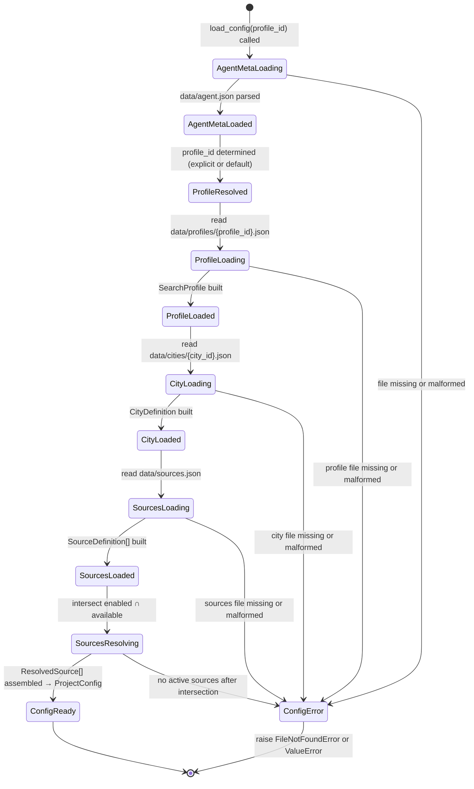

# City-agnostic Config Schema + Scraper Interface — LOD300 System Design

**work_package_id:** S002-P001-WP001
**parent_lod200:** N/A (Team 00 direct mandate; LOD200 implicit in canonization work plan)

---

## 1. System Behavior Overview

The current configuration layer is hardcoded to a single city (Basel). This WP refactors it into a **three-entity model** separating geographic city definitions, a global source platform registry, and user search profiles.

The separation is designed for a clean S003 transition to multi-user SaaS: city definitions and sources remain global/shared, while search profiles gain an `owner_user_id` field.

**Current state (S001):**
- `data/config.json` — single flat file mixing city geography with user preferences
- `data/sources.json` — single flat file with 4 platform definitions (Basel-specific URLs)
- `AgentConfig` dataclass — monolithic, loads from single config
- `BaseScraper.__init__(source_id, search_url)` — no city context
- CLI: `python -m shaked_wg_agent run` — no city/profile selection

**Target state (S002-P001-WP001):**
- `data/cities/{city_id}.json` — per-city geographic definition (bbox, zips, available sources)
- `data/sources.json` — global source registry with per-city connection parameters
- `data/profiles/{profile_id}.json` — user search profile (budget, diet, smoking, transit, tags, notifications)
- `data/agent.json` — global agent metadata (default profile, project window)
- `CityDefinition` dataclass — geographic context (shared, admin-managed)
- `SearchProfile` dataclass — user search preferences (per-user in S003)
- `SourceDefinition` dataclass — global platform registry with city-specific params
- `BaseScraper.__init__(source_id, search_url, city)` — receives CityDefinition
- `score_listing(listing, profile)` — scoring from SearchProfile (user prefs)
- CLI: `python -m shaked_wg_agent run [--profile <profile_id>]` — optional profile selection

---

## 2. Component Interactions

```
                  CLI (--profile flag)
                       │
                       ▼
             ┌──────────────────┐
             │   load_config    │
             │ (profile_id: str)│
             └───────┬──────────┘
                     │
        ┌────────────┼────────────┐
        ▼            ▼            ▼
  data/agent.json  data/profiles/ data/cities/
  (AgentMeta)      {profile_id}.json {city_id}.json
                   (SearchProfile)  (CityDefinition)
                        │               │
                        │    ┌──────────┘
                        ▼    ▼
                  data/sources.json
                  (SourceDefinition[])
                        │
            ┌───────────┘
            ▼  resolve: profile.enabled_sources
               ∩ city.available_sources
            │
            ▼
  ┌────────────────────────┐
  │     ProjectConfig      │
  │  .agent: AgentMeta     │
  │  .profile: SearchProfile│
  │  .city: CityDefinition │
  │  .sources: ResolvedSource[] │
  └───────────┬────────────┘
              │
   ┌──────────┼──────────┐
   ▼          ▼          ▼
BaseScraper  scorer.py  runner.py
(city)       (profile)  (profile_id)
```

**Sequence — config load:**

```
1. CLI parses --profile flag (or None)
2. load_config(profile_id=None) called
3. If profile_id is None → read data/agent.json → use default_profile_id
4. Read data/profiles/{profile_id}.json → build SearchProfile
5. Extract profile.city_id → read data/cities/{city_id}.json → build CityDefinition
6. Read data/sources.json → build SourceDefinition[]
7. Resolve active sources:
   a. Intersect profile.enabled_sources with city.available_sources
   b. For each source_id in intersection:
      - Get SourceDefinition from registry
      - Get CitySourceParams from source.city_params[city_id]
      - Build ResolvedSource
   c. Sort by priority
8. Read data/agent.json → build AgentMeta
9. Return ProjectConfig(agent, profile, city, sources)
```

**Sequence — scraper binding:**

```
1. runner.run_scan() receives ProjectConfig
2. For each ResolvedSource:
   a. _build_scraper(source, city) → scraper instance
   b. scraper.fetch_listings() → uses city.bounding_box / city.zip_filter
3. Listings scored via scorer.score_listing(listing, profile)
   → parameters (transit_lines, diet, smoking_policy, budget, rental_duration, custom_tags) from SearchProfile
```

---

## 3. State Model



---

## 4. Data Model

### 4.1 AgentMeta (global metadata)

| Field | Type | Required | Default | Description |
|-------|------|----------|---------|-------------|
| `default_profile_id` | string | yes | — | Profile to load when no --profile flag given |
| `manual_triggers_only` | bool | no | true | Whether automatic polling is disabled |
| `project_window_days` | int | no | 60 | Days from project start to deadline |
| `project_start` | string (ISO date) | no | — | Project start date |
| `project_end` | string (ISO date) | no | — | Project end date |

**File:** `data/agent.json`

### 4.2 CityDefinition (geographic entity — shared/global)

| Field | Type | Required | Default | Description |
|-------|------|----------|---------|-------------|
| `city_id` | string | yes | — | Unique identifier: "basel", "zurich", "bern" |
| `city_name` | string | yes | — | Display name: "Basel", "Zuerich", "Bern" |
| `country` | string | no | "CH" | ISO 3166-1 alpha-2 |
| `bounding_box` | BoundingBox | yes | — | Geographic search area |
| `zip_filter` | list[string] | no | [] | Valid postal codes (empty = accept all) |
| `available_sources` | list[string] | yes | — | Source IDs available for this city |

**File:** `data/cities/{city_id}.json`

**S003 transition:** CityDefinition remains shared/global. No `owner_user_id` needed — cities are admin-managed entities.

### 4.3 SearchProfile (user preferences — per-user in S003)

| Field | Type | Required | Default | Description |
|-------|------|----------|---------|-------------|
| `profile_id` | string | yes | — | Unique profile identifier: "default" |
| `profile_name` | string | yes | — | Human label for this search profile |
| `city_id` | string | yes | — | Reference to CityDefinition |
| `move_in_from` | string (ISO date) | yes | — | Earliest move-in date |
| `budget_min_chf` | int | yes | — | Minimum monthly rent (CHF) |
| `budget_max_chf` | int | yes | — | Maximum monthly rent (CHF) |
| `preferred_roommate_age` | string | yes | — | Age preference: "young" (18-30), "mixed" (25-40), "any", or "" |
| `rental_duration` | string | yes | — | Rental type: "temporary" (≤3 months), "short" (≤11 months), "permanent" (>11 months) |
| `diet` | string | no | "" | "vegan", "vegetarian", or "" |
| `smoking_policy` | string | no | "" | "non_smoking", "smoking_ok", or "" (no preference) |
| `transit_lines` | list[string] | no | [] | Preferred public transport lines (tram, bus, S-Bahn) |
| `custom_tags` | list[string] | no | [] | User-defined search tags, max 3 (e.g. "musicians", "lgbtq-friendly", "pet-friendly") |
| `language_policy` | LanguagePolicy | no | default de | Listing language preferences |
| `retention_days` | int | no | 30 | Days before stale listings are purged |
| `enabled_sources` | list[string] | no | [] | Subset of city.available_sources to activate (empty = all available) |
| `notifications` | NotificationConfig | no | null | Notification settings for this profile (see S002-P003-WP001) |

**File:** `data/profiles/{profile_id}.json`

**S003 transition:** SearchProfile gains `owner_user_id: string` field. Profile files migrate to PostgreSQL `search_profiles` table. Each user can have one or more profiles.

### 4.4 SourceDefinition (global platform registry)

| Field | Type | Required | Default | Description |
|-------|------|----------|---------|-------------|
| `source_id` | string | yes | — | Platform identifier: "flatfox", "wgzimmer", etc. |
| `label` | string | yes | — | Display label |
| `base_url` | string | yes | — | Platform base URL |
| `scraper_class` | string | yes | — | Scraper implementation class name |
| `requires_playwright` | bool | no | false | Whether scraper needs Playwright browser |
| `notes` | string | no | "" | Platform-specific notes |
| `city_params` | dict[string, CitySourceParams] | yes | — | Per-city connection parameters (key = city_id) |

**File:** `data/sources.json` (array of SourceDefinition)

### 4.5 CitySourceParams (per-city source connection)

| Field | Type | Required | Default | Description |
|-------|------|----------|---------|-------------|
| `search_url` | string | yes | — | Fully resolved search URL for this city |
| `connection_method` | string | no | "" | How the source connects to the city: "bbox", "canton", "city_id_param" |
| `enabled` | bool | no | true | Whether this source is operational for this city |

Embedded as values in `SourceDefinition.city_params`.

### 4.6 BoundingBox

| Field | Type | Required | Description |
|-------|------|----------|-------------|
| `west` | float | yes | Western longitude boundary |
| `east` | float | yes | Eastern longitude boundary |
| `south` | float | yes | Southern latitude boundary |
| `north` | float | yes | Northern latitude boundary |

### 4.7 ResolvedSource (runtime assembly — not persisted)

| Field | Type | Description |
|-------|------|-------------|
| `source_id` | string | Platform ID |
| `label` | string | Display label |
| `base_url` | string | Platform URL |
| `search_url` | string | City-specific search URL (from city_params) |
| `scraper_class` | string | Scraper implementation |
| `requires_playwright` | bool | Needs Playwright? |
| `priority` | int | Sort order |
| `notes` | string | Platform notes |

Built at runtime from `SourceDefinition + CitySourceParams` for the active city.

### 4.8 ProjectConfig (refactored assembly)

```
ProjectConfig
├── agent: AgentMeta              ← global metadata
├── profile: SearchProfile        ← active search profile (user preferences)
├── city: CityDefinition          ← resolved city (geography)
└── sources: list[ResolvedSource] ← resolved active sources
    └── active_sources: list[ResolvedSource]  (property: sorted by priority)
```

### 4.9 File System Layout

```
data/
├── agent.json                        ← AgentMeta (default_profile_id, project window)
├── cities/
│   ├── basel.json                    ← CityDefinition (bbox, zips, available_sources)
│   ├── zurich.json                  ← added in S002-P001-WP002
│   └── bern.json                    ← added in S002-P001-WP002
├── sources.json                      ← Global SourceDefinition[] with city_params
├── profiles/
│   └── default.json                 ← SearchProfile (budget, diet, smoking, transit, tags, city_id="basel")
├── listings.json                     ← remains global (all cities/profiles)
└── runs.json                         ← remains global (all cities/profiles)
```

---

## 5. Interface Contracts

| Interface | Producer | Consumer | Contract |
|-----------|----------|----------|----------|
| `load_config(profile_id: str \| None) → ProjectConfig` | config.py | runner.py, __main__.py | Loads profile → resolves city → resolves sources. Raises on missing profile/city. |
| `CityDefinition` dataclass | config.py | scrapers | Immutable after construction; geographic context (bbox, zips) |
| `SearchProfile` dataclass | config.py | scorer.py, runner.py, notifications | Immutable after construction; user search preferences |
| `BaseScraper.__init__(source_id, search_url, city)` | base.py | flatfox.py, wgzimmer.py, wg_gesucht.py | All scrapers accept `city: CityDefinition`; use bbox/zips as needed |
| `score_listing(listing, profile)` | scorer.py | runner.py | Scoring params (transit_lines, diet, smoking_policy, budget, rental_duration, custom_tags) from SearchProfile |
| `run_scan(profile_id: str \| None) → dict` | runner.py | __main__.py, API (S002-P002-WP001) | profile_id param; resolves to full ProjectConfig internally |

---

## 6. Business Rules

1. **city_id format:** Lowercase, alphanumeric + hyphens only. Regex: `^[a-z][a-z0-9-]{0,29}$`. Max 30 chars.
2. **profile_id format:** Same regex as city_id: `^[a-z][a-z0-9-]{0,29}$`. Max 30 chars.
3. **City file must exist:** `data/cities/{city_id}.json` must exist and be valid JSON. Missing raises `FileNotFoundError`.
4. **Profile file must exist:** `data/profiles/{profile_id}.json` must exist and be valid JSON. Missing raises `FileNotFoundError`.
5. **Default profile resolution:** If `--profile` not given, `data/agent.json` field `default_profile_id` is used. If absent or empty, raise `ValueError("No default profile configured")`.
6. **Source resolution:** Active sources = `profile.enabled_sources INTERSECT city.available_sources`. If `profile.enabled_sources` is empty, all `city.available_sources` are used. Invalid source IDs (not in registry) are logged and skipped.
7. **enabled_sources subset rule:** `profile.enabled_sources` must be a subset of `city.available_sources`. Entries not in `city.available_sources` are logged as warnings and skipped (not an error).
8. **Backward compatibility:** The old flat `data/config.json` is NOT auto-migrated. A one-time manual migration script will be provided (out of WP scope — documented in LOD500).
9. **Listings remain global:** `data/listings.json` stores listings from all cities. Each listing's `source` + `source_listing_id` ensures uniqueness. The `city_id` and `profile_id` fields are added to each listing dict.
10. **Runs remain global:** `data/runs.json` gains `city_id` and `profile_id` fields per run record.
11. **Scoring weights are global:** The scoring formula uses dimensions from SearchProfile: diet, smoking_policy, transit_lines, preferred_roommate_age, rental_duration, budget, custom_tags, plus freshness and URL quality. Exact weights are defined in scorer.py. All scoring parameters come from SearchProfile (not CityDefinition).
12a. **custom_tags limit:** A SearchProfile may have at most 3 entries in `custom_tags`. Tags are free-text strings used for keyword matching against listing descriptions. Empty tags are ignored.
12. **BoundingBox used by flatfox:** The `bounding_box` field on CityDefinition is used by the flatfox scraper for its bbox query. Other scrapers may ignore it.
13. **zip_filter used by all scrapers:** Scrapers filter results to only include listings with postal codes in `city.zip_filter`. If empty, all postal codes are accepted.
14. **Many-to-many city-source relationship:** The global source registry defines all platforms. Each city lists `available_sources`. Each profile lists `enabled_sources`. The intersection determines the actual scrapers to run.
15. **CLI flag:** `--profile <profile_id>` is the primary flag. `--city <city_id>` is accepted as a deprecated alias that resolves to the first profile targeting that city (logged as deprecation warning).

---

## 7. Acceptance Criteria (System Behavior Level)

| AC | Description | Verification |
|----|-------------|--------------|
| AC-1 | `load_config("default")` returns ProjectConfig with SearchProfile matching current Basel values and CityDefinition with Basel bbox/zips | Unit test |
| AC-2 | `load_config(None)` with `default_profile_id: "default"` behaves identically to AC-1 | Unit test |
| AC-3 | `load_config("nonexistent")` raises FileNotFoundError | Unit test |
| AC-4 | `BaseScraper.__init__` accepts `city: CityDefinition` as third parameter | Signature check |
| AC-5 | `score_listing(listing, profile)` uses SearchProfile for transit_lines, diet, smoking_policy, budget, rental_duration, custom_tags | Unit test |
| AC-6 | `python -m shaked_wg_agent run --profile default` produces run record with `profile_id: "default"` and `city_id: "basel"` | Integration test |
| AC-7 | `python -m shaked_wg_agent run` (no flag) uses default_profile_id from agent.json | Integration test |
| AC-8 | Source resolution correctly intersects `profile.enabled_sources` with `city.available_sources` | Unit test |
| AC-9 | All existing 53 tests continue to pass (backward-compatible refactor) | pytest |
| AC-10 | Listing dicts include both `city_id` and `profile_id` fields | Unit test |
| AC-11 | Run records include both `city_id` and `profile_id` fields | Unit test |
| AC-12 | CityDefinition for "basel" loads from `data/cities/basel.json` with correct bbox values | Unit test |

---

## 8. Open Design Questions (Resolved)

| Question | Decision | Rationale |
|----------|----------|-----------|
| Should listings.json be split per city or per profile? | **No — keep global.** | Simpler persistence. city_id + profile_id fields enable filtering. Split deferred to S003 (PostgreSQL). |
| Should search_url use templates with placeholders? | **No — fully resolved URLs per source per city in city_params.** | Simpler, explicit. Templates add complexity for 3 cities. |
| Should old config.json be auto-migrated? | **No — manual one-time migration script.** | Auto-migration adds fragile code. Default profile + Basel city created manually once. |
| Should notifications be per-city or per-profile? | **Per-profile.** | Notifications are user preferences, not city properties. Different users may want different notification settings for the same city. |
| Should sources be per-city or global? | **Global registry with per-city params.** | Many-to-many city-source relationship. Adding a new source = one registry entry + city_params per supported city. |
| Where do user preferences (budget, diet, smoking, transit, tags) belong? | **SearchProfile, not CityDefinition.** | In S003, different users will have different preferences for the same city. Geography is shared; preferences are personal. |
| Should profiles be nested in directories or flat files? | **Flat files: `data/profiles/{profile_id}.json`.** | Maps cleanly to future PostgreSQL rows. Notifications embedded in profile (not a separate file). |

---

## 9. S003 Transition Path

| S002 Entity | S003 Change | Migration |
|-------------|-------------|-----------|
| `data/profiles/{id}.json` (SearchProfile) | Gains `owner_user_id` field → PostgreSQL `search_profiles` table | JSON → DB rows; default profile assigned to first user |
| `data/cities/{id}.json` (CityDefinition) | No structural change → PostgreSQL `cities` table | JSON → DB rows; remains admin-managed |
| `data/sources.json` (SourceDefinition[]) | No structural change → PostgreSQL `sources` + `city_source_params` tables | JSON → DB rows + join table |
| `data/agent.json` (AgentMeta) | `default_profile_id` becomes per-user preference | Moves to user settings table |
| `data/listings.json` | Gains `owner_user_id` → PostgreSQL `listings` table with row-level isolation | JSON → DB with tenant scoping |
| `data/runs.json` | Gains `owner_user_id` → PostgreSQL `runs` table | JSON → DB with tenant scoping |

No structural model changes needed in S003 — only storage layer and user ownership.

---

## 10. LOD300 Exit Criteria

- [x] All component interfaces defined (three-entity model)
- [x] All state transitions defined (profile → city → sources resolution)
- [x] No open design questions
- [x] S003 transition path documented
- [ ] Consuming team (builder) confirms: executable from this design
