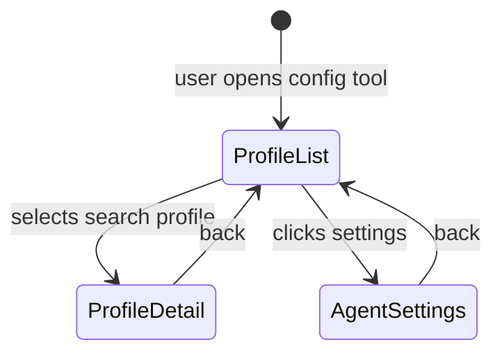

# Mockup — S002-P001-WP001: City-agnostic Config Schema

**Format:** HTML Prototype (Option B) + Screen Narrative
**WP:** S002-P001-WP001
**Screens:** 4 | **Flows:** 2
**HTML files:** `mockup_html/`

---

## Section 1: State Diagram

## Section 2: Screen/View Inventory

| Screen Name | States | Entry Condition | Primary Actor | Exit Destinations |
|-------------|--------|-----------------|---------------|-------------------|
| Profile List | ProfileList | App open | Operator | ProfileDetail, AgentSettings |
| Profile Detail | ProfileDetail | Profile selected | Operator | ProfileList |
| Agent Settings | AgentSettings | Settings clicked | Operator | ProfileList |

## Section 3: Screen Narratives

### Screen: Profile List (`profile_list.html`)
**Active in states:** ProfileList
**Entry:** Default view on open
**Layout:**
- Header: "Suchprofile" (Search Profiles) title
- Section 1: Profile cards (1 per SearchProfile) showing profile_name, target city, budget range, diet, smoking_policy, rental_duration, enabled sources count
- Section 2: "Verfuegbare Staedte" (Available Cities) — read-only reference cards showing CityDefinition summaries (city_name, bbox area, PLZ count, available sources)
- Actions: "Profil anzeigen" per profile card, "Agent-Einstellungen" nav link

### Screen: Profile Detail (`profile_detail.html`)
**Active in states:** ProfileDetail
**Entry:** Click on profile card
**Layout:**
- Header: Profile name + profile_id badge
- Card 1 "Suchprofil": User preferences — budget, diet, smoking_policy, transit_lines, preferred_roommate_age, rental_duration, custom_tags, move_in_from, enabled_sources, retention_days
- Card 2 "Zielstadt (read-only)": CityDefinition reference — city_name, bbox, zip_filter, available_sources
- Actions: Back to list

### Screen: Agent Settings (`agent_settings.html`)
**Active in states:** AgentSettings
**Entry:** Click settings nav
**Layout:**
- Fields: default_profile_id, manual_triggers_only, project dates
- Actions: Back to list

## Section 4: Critical Flows

### Flow 1: View Search Profile
1. Operator opens Profile List — sees 1 search profile card (Default → Basel) + 3 city reference cards
2. Clicks "Default" profile → Profile Detail shows SearchProfile fields + CityDefinition reference
3. Clicks back → returns to list

### Flow 2: Check Agent Settings
1. From Profile List, clicks "Agent-Einstellungen"
2. Sees default_profile_id = "default", project window dates
3. Clicks back → returns to list
