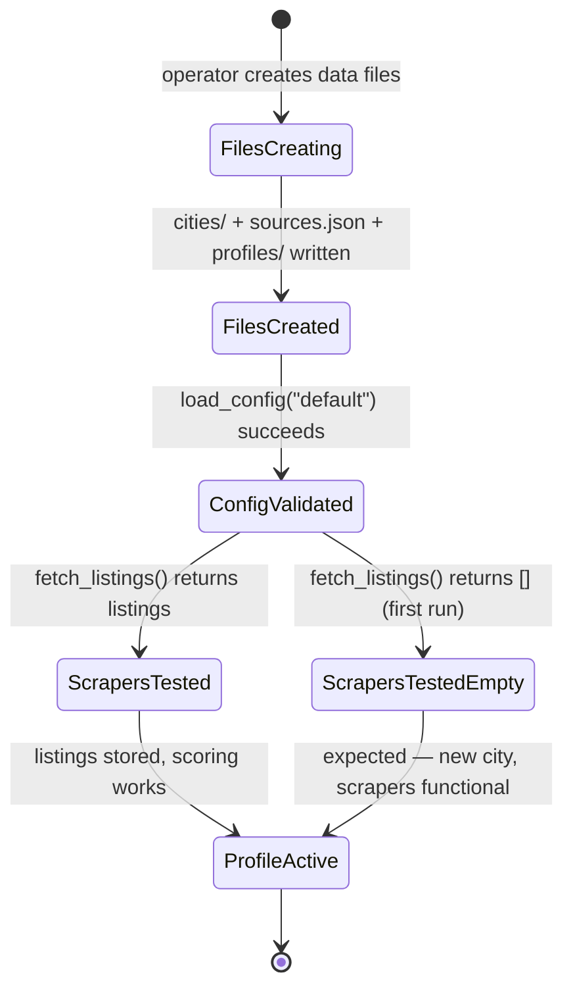

# Add Zurich + Bern City Definitions — LOD300 System Design

**work_package_id:** S002-P001-WP002
**depends_on:** S002-P001-WP001 (three-entity model must be implemented first)

---

## 1. System Behavior Overview

This WP creates city definitions for Zurich and Bern, migrates the Basel configuration into the new three-entity model, populates the global source registry, and creates the default search profile.

**Deliverables:**
- `data/cities/basel.json` — CityDefinition migrated from current config
- `data/cities/zurich.json` — new CityDefinition for Zurich
- `data/cities/bern.json` — new CityDefinition for Bern
- `data/sources.json` — global source registry with per-city params
- `data/profiles/default.json` — single search profile targeting Basel
- `data/agent.json` — global metadata with `default_profile_id: "default"`

---

## 2. Component Interactions

```
data/
├── agent.json                    ← AgentMeta (default_profile_id: "default")
├── cities/
│   ├── basel.json                ← CityDefinition (bbox, zips, available_sources)
│   ├── zurich.json               ← CityDefinition (bbox, zips, available_sources)
│   └── bern.json                 ← CityDefinition (bbox, zips, available_sources)
├── sources.json                  ← Global SourceDefinition[] with city_params
├── profiles/
│   └── default.json              ← SearchProfile (city_id: "basel", budget, diet, smoking, transit, tags)
├── listings.json                 ← unchanged
└── runs.json                     ← unchanged
```

**Platform-to-City matrix (many-to-many via source registry):**

```
┌─────────────────┬──────────┬──────────┬──────────┐
│ Platform        │ Basel    │ Zurich   │ Bern     │
├─────────────────┼──────────┼──────────┼──────────┤
│ flatfox.ch      │ ✅ bbox  │ ✅ bbox  │ ✅ bbox  │
│ wgzimmer.ch     │ ✅ canton│ ✅ canton│ ✅ canton│
│ wg-gesucht.de   │ ❌ auth  │ ❌ auth  │ ❌ auth  │
│ tutti.ch        │ ✅ canton│ ❌ n/a   │ ❌ n/a   │
└─────────────────┴──────────┴──────────┴──────────┘
```

---

## 3. State Model



---

## 4. Data Model

### 4.1 Basel — CityDefinition

**File:** `data/cities/basel.json`

```json
{
  "city_id": "basel",
  "city_name": "Basel",
  "country": "CH",
  "bounding_box": {
    "west": 7.5147,
    "east": 7.6559,
    "south": 47.5176,
    "north": 47.5956
  },
  "zip_filter": [
    "4001", "4002", "4003", "4004", "4005", "4007", "4008", "4009",
    "4010", "4011", "4012", "4016", "4017", "4018", "4019", "4020",
    "4025", "4031", "4051", "4052", "4053", "4054", "4055", "4056",
    "4057", "4058", "4059"
  ],
  "available_sources": ["wgzimmer", "flatfox", "tutti"]
}
```

### 4.2 Zurich — CityDefinition

**File:** `data/cities/zurich.json`

```json
{
  "city_id": "zurich",
  "city_name": "Zuerich",
  "country": "CH",
  "bounding_box": {
    "west": 8.4680,
    "east": 8.6160,
    "south": 47.3400,
    "north": 47.4200
  },
  "zip_filter": [
    "8001", "8002", "8003", "8004", "8005", "8006", "8008",
    "8032", "8037", "8038", "8041", "8044", "8045", "8046",
    "8047", "8048", "8049", "8050", "8051", "8052", "8053",
    "8055", "8057", "8063", "8064"
  ],
  "available_sources": ["wgzimmer", "flatfox", "wg-gesucht"]
}
```

**Notes on Zurich:**
- VBZ public transport network has 13 tram lines + bus/S-Bahn — but transit_lines are in the SearchProfile, not here
- Bounding box covers Zurich city proper + Oerlikon, Altstetten, Wiedikon
- wg-gesucht listed as available (city has a page) but currently disabled in source registry

### 4.3 Bern — CityDefinition

**File:** `data/cities/bern.json`

```json
{
  "city_id": "bern",
  "city_name": "Bern",
  "country": "CH",
  "bounding_box": {
    "west": 7.3900,
    "east": 7.4900,
    "south": 46.9200,
    "north": 46.9700
  },
  "zip_filter": [
    "3001", "3003", "3004", "3005", "3006", "3007", "3008",
    "3010", "3011", "3012", "3013", "3014", "3015", "3018",
    "3020", "3024", "3027", "3030"
  ],
  "available_sources": ["wgzimmer", "flatfox"]
}
```

**Notes on Bern:**
- Bernmobil public transport lines (tram 3, 6, 7, 8, 9 + bus/S-Bahn) — stored in SearchProfile, not here
- Bounding box covers city center + Laenggasse, Kirchenfeld, Buempliz

### 4.4 Global Source Registry

**File:** `data/sources.json`

```json
[
  {
    "source_id": "wgzimmer",
    "label": "wgzimmer.ch",
    "base_url": "https://www.wgzimmer.ch",
    "scraper_class": "WgzimmerScraper",
    "requires_playwright": true,
    "notes": "Hauptquelle. Canton-basierte Suche.",
    "city_params": {
      "basel": {
        "search_url": "https://www.wgzimmer.ch/en/wgzimmer/search/mate/ch/baselstadt.html",
        "connection_method": "canton",
        "enabled": true
      },
      "zurich": {
        "search_url": "https://www.wgzimmer.ch/en/wgzimmer/search/mate/ch/zuerich.html",
        "connection_method": "canton",
        "enabled": true
      },
      "bern": {
        "search_url": "https://www.wgzimmer.ch/en/wgzimmer/search/mate/ch/bern.html",
        "connection_method": "canton",
        "enabled": true
      }
    }
  },
  {
    "source_id": "flatfox",
    "label": "flatfox.ch",
    "base_url": "https://flatfox.ch",
    "scraper_class": "FlatfoxScraper",
    "requires_playwright": false,
    "notes": "Schweizer Plattform. Bbox-basierte REST API.",
    "city_params": {
      "basel": {
        "search_url": "https://flatfox.ch/de/search/?west=7.5147&east=7.6559&south=47.5176&north=47.5956",
        "connection_method": "bbox",
        "enabled": true
      },
      "zurich": {
        "search_url": "https://flatfox.ch/de/search/?west=8.4680&east=8.6160&south=47.3400&north=47.4200",
        "connection_method": "bbox",
        "enabled": true
      },
      "bern": {
        "search_url": "https://flatfox.ch/de/search/?west=7.3900&east=7.4900&south=46.9200&north=46.9700",
        "connection_method": "bbox",
        "enabled": true
      }
    }
  },
  {
    "source_id": "wg-gesucht",
    "label": "wg-gesucht.de",
    "base_url": "https://www.wg-gesucht.de",
    "scraper_class": "WgGesuchtScraper",
    "requires_playwright": false,
    "notes": "DISABLED: requires login/CAPTCHA for Swiss cities.",
    "city_params": {
      "basel": {
        "search_url": "",
        "connection_method": "city_id_param",
        "enabled": false
      },
      "zurich": {
        "search_url": "",
        "connection_method": "city_id_param",
        "enabled": false
      },
      "bern": {
        "search_url": "",
        "connection_method": "city_id_param",
        "enabled": false
      }
    }
  },
  {
    "source_id": "tutti",
    "label": "tutti.ch",
    "base_url": "https://www.tutti.ch",
    "scraper_class": "TuttiScraper",
    "requires_playwright": false,
    "notes": "Manchmal guenstige Angebote. Nur Basel implementiert.",
    "city_params": {
      "basel": {
        "search_url": "https://www.tutti.ch/de/li/basel-stadt/immobilien/wohnungen-mieten",
        "connection_method": "canton",
        "enabled": false
      }
    }
  }
]
```

### 4.5 Default Search Profile

**File:** `data/profiles/default.json`

```json
{
  "profile_id": "default",
  "profile_name": "Shaked Basel WG Search",
  "city_id": "basel",
  "move_in_from": "2026-06-01",
  "budget_min_chf": 200,
  "budget_max_chf": 1000,
  "preferred_roommate_age": "young",
  "rental_duration": "permanent",
  "diet": "vegan",
  "smoking_policy": "non_smoking",
  "transit_lines": ["2", "3", "8", "16"],
  "custom_tags": [],
  "language_policy": {
    "primary_listing_language": "de",
    "translation_required": false,
    "preserve_source_text": true
  },
  "retention_days": 30,
  "enabled_sources": ["wgzimmer", "flatfox"],
  "notifications": {
    "digest_max_listings": 5,
    "min_score_threshold": 40,
    "channels": []
  }
}
```

**Notes:** This is the single implicit profile for S002 (single user). It targets Basel with Shaked's personal preferences. In S003, this profile gains `owner_user_id`. Zurich and Bern city definitions exist but have no profiles yet — they are available for future profiles to reference.

### 4.6 Agent Metadata

**File:** `data/agent.json`

```json
{
  "default_profile_id": "default",
  "manual_triggers_only": true,
  "project_window_days": 60,
  "project_start": "2026-04-09",
  "project_end": "2026-06-08"
}
```

---

## 5. Interface Contracts

| Interface | Producer | Consumer | Contract |
|-----------|----------|----------|----------|
| `data/cities/{city_id}.json` | This WP (file creation) | config.py `load_config()` | Must conform to CityDefinition schema from WP001 |
| `data/sources.json` | This WP (file creation) | config.py `load_config()` | Must conform to SourceDefinition[] schema from WP001 |
| `data/profiles/{profile_id}.json` | This WP (file creation) | config.py `load_config()` | Must conform to SearchProfile schema from WP001 |
| `data/agent.json` | This WP (file creation) | config.py `load_config()` | Must conform to AgentMeta schema from WP001 |
| wgzimmer canton URL | This WP (sources.json city_params) | wgzimmer scraper | Canton name in URL matches wgzimmer.ch URL pattern |
| flatfox bbox URL | This WP (sources.json city_params) | flatfox scraper | west/east/south/north params match CityDefinition bbox |

---

## 6. Business Rules

1. **Basel migration is mandatory in this WP.** Basel data is split: geography → `data/cities/basel.json`, user prefs → `data/profiles/default.json`, sources → `data/sources.json` (global). Old flat files (`data/config.json`, `data/sources.json`) kept as `.bak` backup.
2. **All three cities share the same scraper codebase.** No city-specific scraper code. Platform differences handled by existing scraper classes + CityDefinition parameters.
3. **wgzimmer canton mapping:** Basel → `baselstadt`, Zurich → `zuerich`, Bern → `bern`. Stored in `sources.json` city_params.
4. **flatfox bbox validation:** Bounding box coordinates must produce a rectangle < 0.5 degrees per axis.
5. **City definitions are profile-independent.** CityDefinition contains only geography and available sources — no user preferences (budget, diet, smoking, transit, tags). Those belong in SearchProfile.
6. **Source registry is city-independent at the top level.** Each SourceDefinition has a `city_params` dict mapping city_id to connection parameters. Adding a new city = adding entries to city_params.
7. **Many-to-many city-source relationship:** `city.available_sources` lists which source IDs are available for a city. `sources.json` city_params defines how each source connects to each city. The intersection is validated at config load time.
8. **Only one profile in S002.** The "default" profile targets Basel. Zurich and Bern city definitions exist for future profiles (S003 multi-user) but have no profiles in S002.

---

## 7. Acceptance Criteria

| AC | Description | Verification |
|----|-------------|--------------|
| AC-1 | `data/cities/basel.json` exists and conforms to CityDefinition schema | Unit test |
| AC-2 | `data/cities/zurich.json` exists and conforms to CityDefinition schema | Unit test |
| AC-3 | `data/cities/bern.json` exists and conforms to CityDefinition schema | Unit test |
| AC-4 | `data/sources.json` contains 4 sources with city_params for all 3 cities (where applicable) | Unit test |
| AC-5 | `data/profiles/default.json` exists, targets Basel, matches current user preferences | Unit test |
| AC-6 | `load_config("default")` returns ProjectConfig with correct Basel city + default profile | Unit test |
| AC-7 | Source resolution: default profile → enabled_sources ∩ basel.available_sources → [wgzimmer, flatfox] | Unit test |
| AC-8 | Zurich bounding box is within valid Swiss coordinates | Assertion |
| AC-9 | Bern bounding box is within valid Swiss coordinates | Assertion |
| AC-10 | `data/agent.json` has `default_profile_id: "default"` | File check |

---

## 8. Open Design Questions (Resolved)

| Question | Decision | Rationale |
|----------|----------|-----------|
| Should Zurich and Bern have search profiles in S002? | **No — city definitions only.** | S002 is single-user. One profile (default→Basel) is sufficient. City definitions exist to demonstrate the model and prepare for S003. |
| Where do user preferences (diet, smoking, transit, budget, tags) go? | **SearchProfile, not CityDefinition.** | In S003, different users will have different preferences for the same city. |
| Should sources be duplicated per city? | **No — global registry with city_params.** | Adding a new city = adding entries to city_params. No file duplication. |
| Keep old data/config.json and data/sources.json? | **Keep as .bak files.** | Safety net; removed in a later cleanup WP. |

---

## 9. LOD300 Exit Criteria

- [x] All component interfaces defined
- [x] All state transitions defined
- [x] No open design questions
- [x] Three-entity model (city/source/profile) consistently applied
- [ ] Consuming team (builder) confirms: executable from this design
