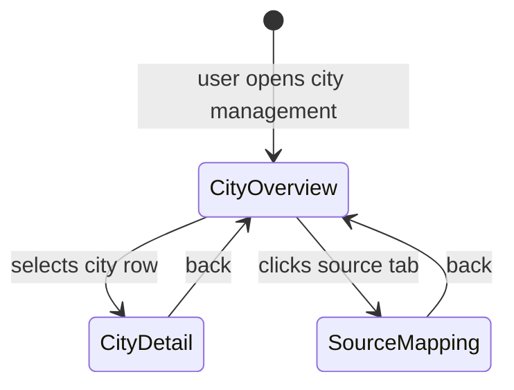

# Mockup — S002-P001-WP002: Zurich + Bern City Definitions

**Format:** HTML Prototype (Option B) + Screen Narrative
**WP:** S002-P001-WP002
**Screens:** 5 | **Flows:** 2
**HTML files:** `mockup_html/`

---

## Section 1: State Diagram

## Section 2: Screen/View Inventory

| Screen Name | States | Entry Condition | Primary Actor | Exit Destinations |
|-------------|--------|-----------------|---------------|-------------------|
| City Overview | CityOverview | App open | Operator | CityDetail, SourceMapping |
| Zurich Detail | CityDetail | Zurich selected | Operator | CityOverview |
| Bern Detail | CityDetail | Bern selected | Operator | CityOverview |
| Source Mapping | SourceMapping | Source tab clicked | Operator | CityOverview |

## Section 3: Screen Narratives

### Screen: City Definitions Overview (`city_profiles.html`)
**Layout:**
- Title: "Stadtdefinitionen" (City Definitions)
- Table: Stadt, Bounding Box, PLZ-Anzahl, Verf. Quellen
- 3 rows: Basel, Zuerich, Bern — geography only (no budget/diet/smoking/transit/tags — those are in SearchProfile)
- Click row → city detail

### Screen: Zurich Definition (`zurich_profile.html`)
**Layout:**
- CityDefinition fields only: city_id, city_name, country, bounding_box, zip_filter, available_sources
- No user preferences (budget, diet, smoking, transit, tags) — those belong in SearchProfile

### Screen: Bern Definition (`bern_profile.html`)
**Layout:**
- CityDefinition fields only: city_id, city_name, country, bounding_box, zip_filter, available_sources
- No user preferences

### Screen: Source Registry (`source_mapping.html`)
**Layout:**
- Title: "Globale Quellenregistrierung" (Global Source Registry)
- Matrix table: Platform x City showing enabled/disabled and connection_method (bbox/canton)
- source_id column added
- References `data/sources.json`

## Section 4: Critical Flows

### Flow 1: Review City Definitions
1. Open City Overview — see all 3 cities with geography summary
2. Click Zurich → see bbox, zips, available sources
3. Note: no budget/diet/smoking/transit/tags here — those are per-profile

### Flow 2: Check Source Coverage
1. Navigate to Source Registry
2. See which platforms are available per city (from global `data/sources.json`)
3. Note wg-gesucht is disabled everywhere (auth requirement)
