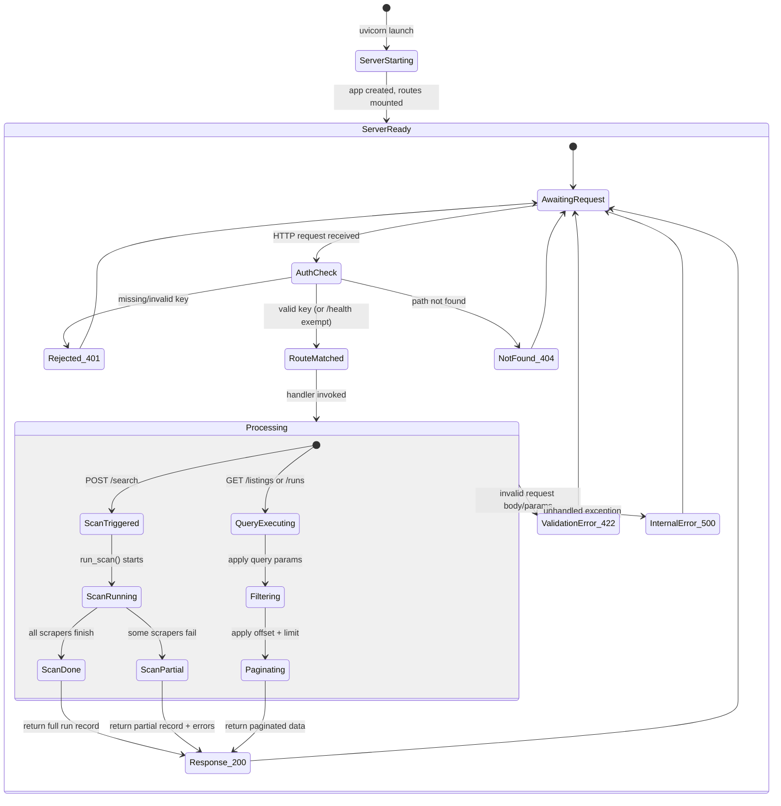

# REST API Layer — /search, /listings, /runs — LOD300 System Design

**work_package_id:** S002-P002-WP001
**profile:** L2.5 / Track B (Team 00 decision 2026-04-12)
**depends_on:** S002-P001-WP001 (Three-entity model — API uses profile_id param)

---

## 1. System Behavior Overview

This WP wraps the existing Python agent into a RESTful API using FastAPI. The API exposes the agent's core operations — triggering scans, querying listings, and retrieving run history — over HTTP with JSON request/response. It does NOT replace the CLI; both interfaces coexist and share the same persistence layer.

**Architecture principle:** The API is a thin layer over `runner.run_scan()`, `persistence.load_listings()`, and `persistence.load_runs()`. No business logic is duplicated. The API adds: HTTP routing, request validation (Pydantic), response serialization, error handling, pagination, and CORS.

**New package:** `shaked_wg_agent/api/`

```
shaked_wg_agent/api/
├── __init__.py
├── app.py           ← create_app() factory → FastAPI instance
├── models.py        ← Pydantic request/response models
├── routes/
│   ├── __init__.py
│   ├── health.py    ← GET /health
│   ├── search.py    ← POST /search
│   ├── listings.py  ← GET /listings, GET /listings/{id}
│   └── runs.py      ← GET /runs, GET /runs/{id}
└── middleware.py    ← auth middleware (S002-P002-WP002), CORS, error handlers
```

---

## 2. Component Interactions

```
                     HTTP Client (curl, frontend, webhook)
                              │
                              ▼
                    ┌────────────────────┐
                    │  FastAPI app.py    │
                    │  (CORS, auth MW)   │
                    └────────┬───────────┘
                             │
              ┌──────────────┼──────────────┐
              ▼              ▼              ▼
        routes/search   routes/listings  routes/runs
              │              │              │
              ▼              ▼              ▼
        runner.run_scan  persistence.   persistence.
        (profile_id)     load_listings  load_runs
              │              │              │
              └──────────────┼──────────────┘
                             ▼
                       data/*.json
                    (shared with CLI)
```

**Sequence — POST /search (synchronous mode):**

```
1. Client sends POST /search {"profile_id": "default"}
2. Auth middleware validates X-API-Key header (S002-P002-WP002)
3. Route handler parses SearchRequest via Pydantic
4. handler calls runner.run_scan(profile_id="default")
5. run_scan() executes: load config → scrape → score → verify → publish
6. Run record returned to handler
7. Handler wraps in response envelope → 200 OK
8. If run_scan() raises → 500 with error envelope
```

**Sequence — GET /listings?city_id=basel&min_score=50&limit=10:**

```
1. Client sends GET /listings?city_id=basel&min_score=50&limit=10
2. Auth middleware validates key
3. Route handler parses query params
4. handler calls persistence.load_listings()
5. Filter by city_id, min_score in memory
6. Apply offset/limit pagination
7. Build PaginatedResponse → 200 OK
```

**Sequence — Error flow (401):**

```
1. Client sends GET /listings without X-API-Key
2. Auth middleware intercepts → 401 Unauthorized
3. Response: {"error": {"code": "UNAUTHORIZED", "message": "Missing or invalid API key"}}
```

---

## 3. State Model



---

## 4. Data Model

### 4.1 Request Models (Pydantic)

**SearchRequest** (POST /search body):

| Field | Type | Required | Default | Description |
|-------|------|----------|---------|-------------|
| `profile_id` | string | no | agent.json default_profile_id | Which search profile to scan (preferred) |
| `city_id` | string | no | — | Deprecated alias — resolved to profile_id internally |

**ListingsQuery** (GET /listings query params):

| Field | Type | Required | Default | Description |
|-------|------|----------|---------|-------------|
| `profile_id` | string | no | — | Filter by search profile |
| `city_id` | string | yes* | — | Filter by city (*not required if profile_id given) |
| `min_score` | int | no | 0 | Minimum relevance score |
| `status` | string | no | null | Filter by status (neu, favorit, etc.) |
| `source` | string | no | null | Filter by source platform |
| `limit` | int | no | 50 | Items per page (max 200) |
| `offset` | int | no | 0 | Skip N items |

**RunsQuery** (GET /runs query params):

| Field | Type | Required | Default | Description |
|-------|------|----------|---------|-------------|
| `profile_id` | string | no | null | Filter by search profile |
| `city_id` | string | no | null | Filter by city |
| `limit` | int | no | 20 | Items per page (max 100) |
| `offset` | int | no | 0 | Skip N items |

### 4.2 Response Models

**ResponseEnvelope[T]:**

```json
{
  "data": T,
  "meta": {
    "timestamp": "2026-04-12T14:30:00+00:00",
    "request_id": "req-a1b2c3d4"
  }
}
```

**PaginatedResponse[T]:**

```json
{
  "data": [T, T, ...],
  "meta": {
    "timestamp": "2026-04-12T14:30:00+00:00",
    "request_id": "req-a1b2c3d4",
    "total_count": 59,
    "offset": 0,
    "limit": 50
  }
}
```

**ErrorResponse:**

```json
{
  "error": {
    "code": "UNAUTHORIZED",
    "message": "Missing or invalid API key",
    "detail": null
  }
}
```

**ListingResponse** (single listing — all fields from listings.json schema):

| Field | Type | Description |
|-------|------|-------------|
| `listing_id` | string | Unique ID (source-sourceListingId) |
| `source` | string | Platform (flatfox, wgzimmer, wg-gesucht) |
| `profile_id` | string | Search profile this listing was found by |
| `city_id` | string | City this listing belongs to |
| `title` | string | Listing title |
| `price_chf` | int or null | Monthly rent |
| `available_from` | string or null | Move-in date |
| `location_text` | string | Address |
| `district` | string | Neighborhood |
| `transit_match_lines` | list[string] | Matched public transport lines |
| `roommate_signal` | string | Roommate age/type signal |
| `vegan_signal` | string | Vegan compatibility signal |
| `summary` | string | Listing snippet |
| `direct_url` | string | Link to listing |
| `url_status` | string | direct / search_only / broken_needs_recovery |
| `relevance_score` | int | 0–100 |
| `status` | string | neu / favorit / interessant / kontaktiert / abgesagt |
| `note` | string | User note |
| `tags` | list[string] | User tags |
| `first_seen_at` | string (ISO 8601) | When first discovered |
| `last_seen_at` | string (ISO 8601) | When last seen in scrape |
| `verified_active` | bool | Whether URL was verified live |
| `last_verified_at` | string or null | Last verification timestamp |

**RunResponse** (single run record):

| Field | Type | Description |
|-------|------|-------------|
| `run_id` | string | Unique run ID |
| `run_timestamp` | string (ISO 8601) | When scan started |
| `profile_id` | string | Search profile used for scan |
| `city_id` | string | City scanned |
| `triggered_by` | string | "manual" / "api" / "cron" |
| `sources_scanned` | int | How many sources were scanned |
| `results_scanned` | int | Total listings found |
| `new_results` | int | New listings added |
| `updated_results` | int | Existing listings updated |
| `stale_removed` | int | Old listings purged |
| `duration_seconds` | int | Scan duration |
| `errors` | list[string] | Scraper errors |
| `report_url` | string or null | Published HTML report URL |
| `notification_sent` | object or null | Notification delivery status |

### 4.3 Error Codes

| HTTP Status | Code | When |
|-------------|------|------|
| 200 | — | Successful response |
| 400 | BAD_REQUEST | Invalid query parameters |
| 401 | UNAUTHORIZED | Missing or invalid API key |
| 404 | NOT_FOUND | Resource not found (listing_id, run_id) |
| 422 | VALIDATION_ERROR | Request body fails Pydantic validation |
| 500 | INTERNAL_ERROR | Unhandled exception |

---

## 5. API Surface

| Method | Path | Auth | Request | Response | Status Codes |
|--------|------|------|---------|----------|-------------|
| GET | `/health` | **No** | — | `{"status": "ok", "version": "0.3.0"}` | 200 |
| POST | `/search` | Yes | SearchRequest (body) | ResponseEnvelope[RunResponse] | 200, 401, 422, 500 |
| GET | `/listings` | Yes | ListingsQuery (query) | PaginatedResponse[ListingResponse] | 200, 400, 401 |
| GET | `/listings/{listing_id}` | Yes | — | ResponseEnvelope[ListingResponse] | 200, 401, 404 |
| GET | `/runs` | Yes | RunsQuery (query) | PaginatedResponse[RunResponse] | 200, 400, 401 |
| GET | `/runs/{run_id}` | Yes | — | ResponseEnvelope[RunResponse] | 200, 401, 404 |

**Auto-generated endpoints:**
- `GET /docs` — Swagger UI (OpenAPI 3.1)
- `GET /openapi.json` — OpenAPI schema

---

## 6. Interface Contracts

| Interface | Producer | Consumer | Contract |
|-----------|----------|----------|----------|
| `runner.run_scan(profile_id)` | runner.py | routes/search.py | Accepts profile_id param (from WP001 refactor); returns run record dict |
| `persistence.load_listings()` | persistence.py | routes/listings.py | Returns list[dict]; filtering done in route handler |
| `persistence.load_runs()` | persistence.py | routes/runs.py | Returns list[dict]; newest first |
| `create_app() → FastAPI` | api/app.py | uvicorn / test client | Factory function; mounts all routes + middleware |
| Auth middleware | api/middleware.py | all routes except /health | Validates X-API-Key header (S002-P002-WP002 implements) |
| CORS middleware | api/app.py | browser clients | Configurable origins via `API_CORS_ORIGINS` env var |

---

## 7. Business Rules

1. **FastAPI framework.** Server entry: `uvicorn shaked_wg_agent.api.app:create_app --factory`. Dev port: 8000.
2. **Response envelope is mandatory.** Every response (success or error) uses the envelope format. No bare JSON arrays.
3. **Pagination defaults and limits.** `limit` default: 50 for listings, 20 for runs. Max: 200 for listings, 100 for runs. `offset` min: 0. Out-of-range offset returns empty `data: []`.
4. **request_id generation.** Each request gets a UUID-based request_id, set in response `meta` and returned in error responses for debugging.
5. **All timestamps are UTC ISO 8601.** No local time in API responses.
6. **POST /search is synchronous.** Scan runs to completion before response. Typical duration: 10–30 seconds. Client should set appropriate timeout. Future: async mode with polling (out of S002 scope).
7. **POST /search sets `triggered_by: "api"`** in the run record (vs "manual" for CLI, "cron" for scheduled).
8. **GET /listings requires city_id OR profile_id.** If profile_id given, city_id is resolved from the profile. Returns 400 if neither is provided.
9. **GET /listings filtering is server-side.** Filter by city_id, min_score, status, source applied in Python (no database). Acceptable performance for < 10,000 listings.
10. **GET /listings sorting.** Always sorted by `relevance_score` descending (matching CLI and HTML report behavior).
11. **GET /runs city_id is optional.** If omitted, returns all runs across cities.
12. **CORS origins.** Set via `API_CORS_ORIGINS` env var (comma-separated). Default: empty (no CORS headers). Example: `API_CORS_ORIGINS=http://localhost:3000,https://nimrod.bio`.
13. **OpenAPI auto-generated.** FastAPI produces `/docs` (Swagger UI) and `/openapi.json` automatically from Pydantic models.
14. **No rate limiting in S002.** Deferred to S003 (multi-tenant). Single-user API key is sufficient.
15. **Shared persistence.** API and CLI share `data/listings.json` and `data/runs.json`. No locking mechanism (single-user, sequential access assumed).
16. **Single profile in S002.** In S002, only one profile exists ('default'). profile_id is always 'default' in practice.

---

## 8. Acceptance Criteria

| AC | Description | Verification |
|----|-------------|--------------|
| AC-1 | `uvicorn shaked_wg_agent.api.app:create_app --factory` starts server on port 8000 | Integration test |
| AC-2 | `GET /health` returns 200 with `{"status": "ok", "version": "..."}` | Integration test |
| AC-3 | `POST /search {"profile_id": "default"}` returns 200 with RunResponse envelope | Integration test |
| AC-4 | `GET /listings?city_id=basel&limit=10` returns paginated ListingResponse array | Integration test |
| AC-5 | `GET /listings?city_id=basel&min_score=50` filters correctly | Unit test |
| AC-6 | `GET /listings/flatfox-85903643` returns single listing or 404 | Integration test |
| AC-7 | `GET /runs?limit=5` returns last 5 runs | Integration test |
| AC-8 | `GET /runs/nonexistent` returns 404 with error envelope | Integration test |
| AC-9 | Request without X-API-Key returns 401 (except /health) | Integration test |
| AC-10 | `GET /docs` returns Swagger UI page | Integration test |
| AC-11 | Response `meta.request_id` is unique per request | Unit test |
| AC-12 | `GET /listings` without city_id or profile_id returns 400 | Unit test |
| AC-13 | `limit=300` is clamped to 200 | Unit test |

---

## 9. Sequence Diagrams

### 9.1 POST /search — Happy Path

```
Client              API (FastAPI)           runner.py           persistence.py
  │                      │                      │                      │
  │  POST /search        │                      │                      │
  │  {"profile_id":      │                      │                      │
  │   "default"}         │                      │                      │
  │────���────────────────>│                      │                      │
  │                      │  validate API key    │                      │
  │                      │  parse SearchRequest │                      │
  │                      │                      │                      │
  │                      │  run_scan("default") │                      │
  │                      │─────────────────────>│                      │
  │                      │                      │load_config("default")│
  │                      │                      │  scrape → upsert    │
  │                      │                      │─────────────────────>│
  │                      │                      │  score → verify     │
  │                      │                      │  publish HTML       │
  │                      │                      │  append_run()       │
  │                      │                      │─────────────────────>│
  │                      │  run_record          │                      │
  │                      │<─────────────────────│                      │
  │  200 OK              │                      │                      │
  │  {data: RunResponse} │                      │                      │
  │<─────────────────────│                      │                      │
```

### 9.2 GET /listings — Paginated Query

```
Client              API (FastAPI)           persistence.py
  │                      │                      │
  │  GET /listings       │                      │
  │  ?city_id=basel      │                      │
  │  &min_score=50       │                      │
  │  &limit=10           │                      │
  │─────────────────────>│                      │
  │                      │  validate API key    │
  │                      │  parse query params  │
  │                      │                      │
  │                      │  load_listings()     │
  │                      │─────────────────────>│
  │                      │  all_listings        │
  │                      │<─────────────────────│
  │                      │                      │
  │                      │  filter: city_id,    │
  │                      │  min_score, status   │
  │                      │  sort: score desc    │
  │                      │  paginate: [0:10]    │
  │                      │                      │
  │  200 OK              │                      │
  │  {data: [...],       │                      │
  │   meta: {total: 42,  │                      │
  │          offset: 0,  │                      │
  │          limit: 10}} │                      │
  │<─────────────────────│                      │
```

### 9.3 Error Flow — 401 Unauthorized

```
Client              API (Middleware)
  │                      │
  │  GET /listings       │
  │  (no X-API-Key)      │
  │─────────────────────>│
  │                      │  check X-API-Key header
  │                      │  → missing
  │  401 Unauthorized    │
  │  {error: {           │
  │    code: "UNAUTHORIZED",
  │    message: "..."}}  │
  │<─────────────────────│
```

---

## 10. Open Design Questions (Resolved)

| Question | Decision | Rationale |
|----------|----------|-----------|
| Sync vs async scan via API? | **Synchronous only in S002.** | Async adds polling complexity. Scan takes 10–30s, acceptable for single-user. Async deferred to S003. |
| Database for listings/runs? | **Keep JSON files.** | < 10,000 records. No concurrent writes. DB migration planned for S003. |
| Separate API server or embedded? | **Separate uvicorn process.** | Clean separation. CLI and API are independent entry points. |
| Versioned API (v1/v2)? | **No versioning in S002.** | Single-user, no external consumers yet. Version prefix deferred to S003 when public contract matters. |
| WebSocket for scan progress? | **No.** | Overkill for single-user. Deferred. |
| Should /search accept filters (sources, etc.)? | **No — full scan only.** | Keeps API simple. Source filtering is config-level (sources.json). |

---

## 11. LOD300 Exit Criteria

- [x] Complete state machine (Mermaid stateDiagram-v2)
- [x] Business rules (numbered, unambiguous)
- [x] Data model (entities, fields, types, constraints)
- [x] API surface (method, path, request, response, error codes)
- [x] Sequence diagrams (primary flows + error flows)
- [x] Integration contracts
- [x] System behavior acceptance criteria
- [x] Open architectural decisions all resolved
- [ ] Consuming team (builder) confirms: executable from this design
