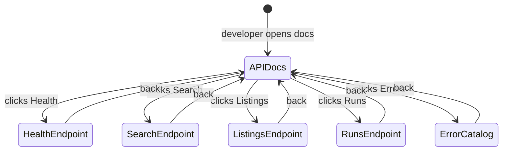

# Mockup — S002-P002-WP001: REST API Layer

**Format:** HTML Prototype (Option B) + Screen Narrative
**WP:** S002-P002-WP001
**Screens:** 7 | **Flows:** 3
**HTML files:** `mockup_html/`

---

## Section 1: State Diagram

## Section 2: Screen/View Inventory

| Screen Name | States | Entry Condition | Primary Actor | Exit Destinations |
|-------------|--------|-----------------|---------------|-------------------|
| API Docs Hub | APIDocs | Open /docs | Developer | All endpoint pages |
| Health Endpoint | HealthEndpoint | Click Health card | Developer | APIDocs |
| Search Endpoint | SearchEndpoint | Click Search card | Developer | APIDocs |
| Listings Endpoint | ListingsEndpoint | Click Listings card | Developer | APIDocs |
| Runs Endpoint | RunsEndpoint | Click Runs card | Developer | APIDocs |
| Error Catalog | ErrorCatalog | Click Errors | Developer | APIDocs |

## Section 3: Screen Narratives

### Screen: API Docs Hub (`index.html`)
**Layout:**
- Title: "Shaked WG Agent — REST API v0.3.0"
- Base URL display, auth note
- Cards for each endpoint group with method badges

### Screen: Health Endpoint (`health_endpoint.html`)
- GET /health — no auth
- Response: status, version, auth_configured

### Screen: Search Endpoint (`search_endpoint.html`)
- POST /search — auth required
- Request body: profile_id (preferred) or city_id (deprecated alias)
- Response: full RunResponse in envelope (includes profile_id + city_id)

### Screen: Listings Endpoint (`listings_endpoint.html`)
- GET /listings — query params (profile_id preferred, city_id deprecated alias, filters, pagination)
- GET /listings/{id} — single listing
- Response: PaginatedResponse with ListingResponse items

### Screen: Runs Endpoint (`runs_endpoint.html`)
- GET /runs — query params (profile_id, city_id deprecated alias, pagination)
- GET /runs/{id} — single run with profile_id
- Response: PaginatedResponse with RunResponse items (includes profile_id)

### Screen: Error Catalog (`error_responses.html`)
- All error codes: 400, 401, 404, 422, 500
- Each with ErrorResponse JSON example

## Section 4: Critical Flows

### Flow 1: Trigger Scan via API
1. Developer sends POST /search with profile_id "default"
2. API validates key → resolves profile → city → sources → runs scan → returns RunResponse

### Flow 2: Query Listings
1. GET /listings?profile_id=default&min_score=50&limit=10
2. Returns paginated filtered listings sorted by score

### Flow 3: Handle Auth Error
1. Request without X-API-Key → 401 UNAUTHORIZED
2. Identical response for missing and invalid keys
