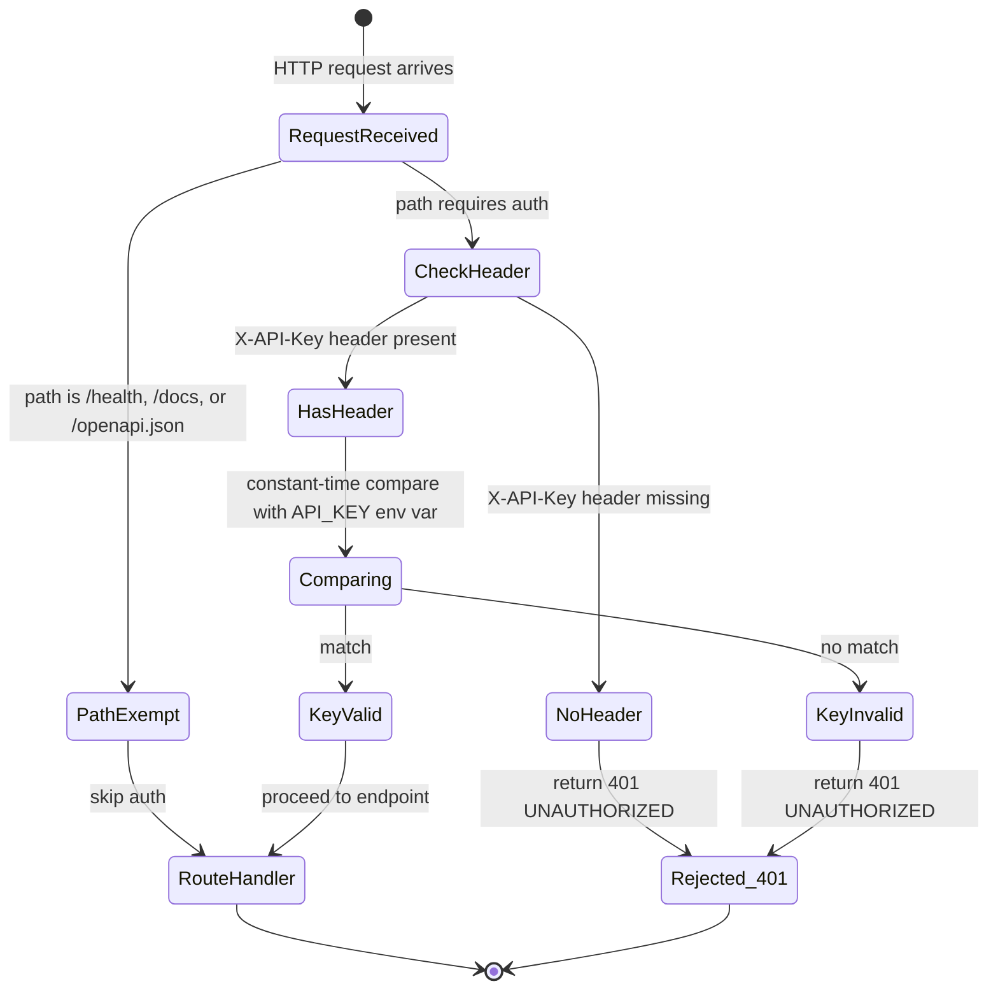

# API Key Auth (Single-User) — LOD300 System Design

**work_package_id:** S002-P002-WP002
**depends_on:** S002-P002-WP001 (REST API layer — auth dependency hooks into FastAPI app)

---

## 1. System Behavior Overview

This WP implements a simple API key authentication dependency for the REST API. It validates a static key passed in the `X-API-Key` HTTP header against a server-side secret stored in an environment variable. This is a single-user, single-key model — no key management, rotation, or multi-tenant support. Those capabilities are planned for S003.

**Scope boundaries:**
- **In scope:** Header validation, constant-time comparison, /health exemption, error response
- **Out of scope:** Key rotation, key management UI, rate limiting, JWT, RBAC, multi-tenant auth

**S003 transition:** This static API key mechanism will be replaced by JWT-based user authentication with RBAC in S003. The single API key maps to the single implicit user in S002. The auth dependency interface (`verify_api_key`) remains the same — only the validation logic changes internally.

---

## 2. Component Interactions

```
HTTP Request
    │
    ▼
┌─────────────────────────────────┐
│  FastAPI Auth Dependency Gate   │
│  ┌──────────────────────────┐   │
│  │  verify_api_key()        │   │
│  │  ┌────────────────────┐  │   │
│  │  │ Is path /health?   │──│──→ SKIP auth → route handler
│  │  │ Is path /docs?     │  │   │
│  │  │ Is path /openapi*? │  │   │
│  │  └────────────────────┘  │   │
│  │           │ NO            │   │
│  │  ┌────────────────────┐  │   │
│  │  │ X-API-Key header?  │  │   │
│  │  └────────┬───────────┘  │   │
│  │      YES  │   NO         │   │
│  │           │   └──────────│──→ 401 {"error": {"code": "UNAUTHORIZED"}}
│  │  ┌─────��──▼───────────┐  │   │
│  │  │ compare(key, env)  │  │   │
│  │  │ constant-time      │  │   │
│  │  └────────┬───────────┘  │   │
│  │     MATCH │  NO MATCH    │   │
│  │           │   └──────────│──→ 401 {"error": {"code": "UNAUTHORIZED"}}
│  │           ▼               │   │
│  │      route handler        │   │
│  └──────────────────────────┘   │
└─────────────────────────────────┘
```

---

## 3. State Model



---

## 4. Data Model

### 4.1 Configuration

| Source | Key | Type | Description |
|--------|------|------|-------------|
| Environment variable | `API_KEY` | string | The secret API key. Min 32 chars, alphanumeric. |

No new persistence. No database. Key lives in `.env` only.

### 4.2 Error Response (reuses ErrorResponse from S002-P002-WP001)

```json
{
  "error": {
    "code": "UNAUTHORIZED",
    "message": "Missing or invalid API key",
    "detail": null
  }
}
```

The error response is intentionally identical for missing key and wrong key — no information leakage about which case triggered the rejection.

---

## 5. Interface Contracts

| Interface | Producer | Consumer | Contract |
|-----------|----------|----------|----------|
| `verify_api_key(request)` | api/auth.py | FastAPI router dependency (`Depends()`) | Validates X-API-Key header; raises 401 or returns None (pass). Attached to auth-required routers only; exempt routes use a separate router without this dependency. |
| `API_KEY` env var | .env file (operator) | auth.py | Must be set; if absent, server returns 500 on any auth-required endpoint |
| Exempt paths list | auth.py constant | auth.py | `["/health", "/docs", "/openapi.json"]` — no auth required |
| Error envelope | auth.py | HTTP client | Uses same `{"error": {...}}` format as API error responses |

---

## 6. Business Rules

1. **Header name:** `X-API-Key` (case-insensitive per HTTP spec, but canonical form is mixed-case).
2. **Constant-time comparison.** Use `hmac.compare_digest()` to prevent timing attacks. Even though this is single-user, it's a security best practice with zero cost.
3. **Exempt paths:** `/health`, `/docs`, `/openapi.json` — always accessible without auth. These are operational and documentation endpoints.
4. **Missing API_KEY env var:** If `API_KEY` is not set in the environment, the server starts but returns 500 Internal Error on any auth-required request. The /health endpoint includes a `"auth_configured": true/false` field for operational monitoring.
5. **Key format:** Minimum 32 characters. Validated at startup — server logs a warning if key is shorter than 32 chars but does not refuse to start.
6. **No key in logs.** The API key value must never appear in logs, error messages, or responses. Only "present/absent" and "valid/invalid" are logged.
7. **No key in URLs.** API key must be passed in header, never as query parameter. Query param `api_key` is ignored.
8. **Response for both missing and invalid key is identical.** `401 UNAUTHORIZED` with the same message — prevents enumeration.
9. **Single key.** One key for the entire API. No per-endpoint or per-user keys. Multi-key support deferred to S003. In S003, the single key is replaced by per-user JWT tokens with role-based access control.

---

## 7. Acceptance Criteria

| AC | Description | Verification |
|----|-------------|--------------|
| AC-1 | Request without `X-API-Key` header returns 401 | Integration test |
| AC-2 | Request with wrong key returns 401 | Integration test |
| AC-3 | Request with correct key returns 200 (for valid endpoint) | Integration test |
| AC-4 | `GET /health` returns 200 without any key | Integration test |
| AC-5 | `GET /docs` returns 200 without any key | Integration test |
| AC-6 | 401 response body matches ErrorResponse schema | Unit test |
| AC-7 | 401 response is identical for missing key and wrong key | Unit test |
| AC-8 | API_KEY env var not set → 500 on auth-required endpoints | Unit test |
| AC-9 | `/health` response includes `auth_configured` field | Unit test |
| AC-10 | Key comparison uses `hmac.compare_digest()` | Code review |

---

## 8. Sequence Diagrams

### 8.1 Valid Key — Happy Path

```
Client              Middleware              Route Handler
  │                      │                      │
  │  GET /listings       │                      │
  │  X-API-Key: abc123   │                      │
  │─────────────────────>│                      │
  │                      │  path exempt? NO     │
  │                      │  header present? YES │
  │                      │  compare_digest()    │
  │                      │  → MATCH             │
  │                      │─────────────────────>│
  │                      │                      │  process request
  │  200 OK              │                      │
  │<─────────────────────│──────────────────────│
```

### 8.2 Missing Key — Rejection

```
Client              Middleware
  │                      │
  │  GET /listings       │
  │  (no X-API-Key)      │
  │─────────────────────>│
  │                      │  path exempt? NO
  │                      │  header present? NO
  │  401 UNAUTHORIZED    │
  │  {"error": {...}}    │
  │<─────────────────────│
```

### 8.3 Health Check — Exempt

```
Client              Middleware              Route Handler
  │                      │                      │
  │  GET /health         │                      │
  │  (no key)            │                      │
  │─────────────────────>│                      │
  │                      │  path exempt? YES    │
  │                      │─────────────────────>│
  │  200 OK              │                      │
  │  {"status":"ok",...}  │                      │
  │<─────────────────────│──────────────────────│
```

---

## 9.5 S003 Transition Path

| S002 | S003 Change |
|------|-------------|
| Static `API_KEY` env var | Per-user JWT tokens from auth service |
| Single key for all endpoints | Role-scoped tokens (admin/agent/viewer) |
| `hmac.compare_digest()` | JWT signature verification |
| No user identity in request | `request.state.user_id` set by middleware |
| 401 only error | 401 (not authenticated) + 403 (not authorized) |

---

## 9. Open Design Questions (Resolved)

| Question | Decision | Rationale |
|----------|----------|-----------|
| Bearer token vs X-API-Key? | **X-API-Key header.** | Simpler, no "Bearer " prefix parsing. Industry standard for API key auth. |
| Key generation on first start? | **No — operator provides.** | Single-user. Operator puts key in .env. Auto-generation adds complexity. |
| Should invalid key return 403 vs 401? | **401 for all.** | RFC 7235: 401 = authentication required. 403 = authenticated but forbidden. We have no "forbidden" case yet. |
| Should /docs require auth? | **No — public.** | API docs are useful for debugging. No sensitive data exposed. Auth required for data endpoints only. |

---

## 10. LOD300 Exit Criteria

- [x] All component interfaces defined
- [x] All state transitions defined
- [x] No open design questions
- [ ] Consuming team (builder) confirms: executable from this design
