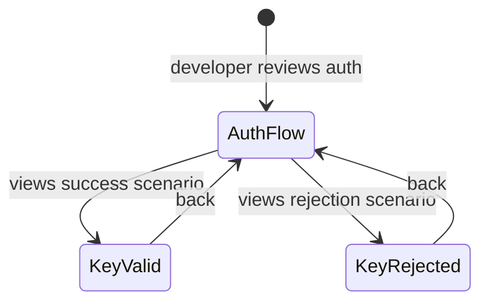

# Mockup — S002-P002-WP002: API Key Auth

**Format:** HTML Prototype (Option B) + Screen Narrative
**WP:** S002-P002-WP002
**Screens:** 4 | **Flows:** 3
**HTML files:** `mockup_html/`

---

## Section 1: State Diagram

## Section 2: Screen/View Inventory

| Screen Name | States | Entry Condition | Primary Actor | Exit Destinations |
|-------------|--------|-----------------|---------------|-------------------|
| Auth Flow | AuthFlow | Open docs | Developer | KeyValid, KeyRejected |
| Key Valid | KeyValid | Click success | Developer | AuthFlow |
| Key Rejected | KeyRejected | Click rejection | Developer | AuthFlow |

## Section 3: Screen Narratives

### Screen: Auth Flow (`auth_flow.html`)
- Visual decision tree: Request → Exempt? → Header? → Compare → Result
- Green path (success) and red path (rejection)

### Screen: Key Valid (`key_valid.html`)
- Successful request/response example
- /health with auth_configured: true

### Screen: Key Rejected (`key_rejected.html`)
- 3 rejection scenarios: missing header, wrong key, server misconfigured
- Identical 401 response for missing/wrong (security note)

## Section 4: Critical Flows

### Flow 1: Authenticated Request
1. GET /listings with X-API-Key → 200 OK

### Flow 2: Missing Key
1. GET /listings without header → 401 UNAUTHORIZED

### Flow 3: Health Check (No Auth)
1. GET /health without key → 200 OK with status
