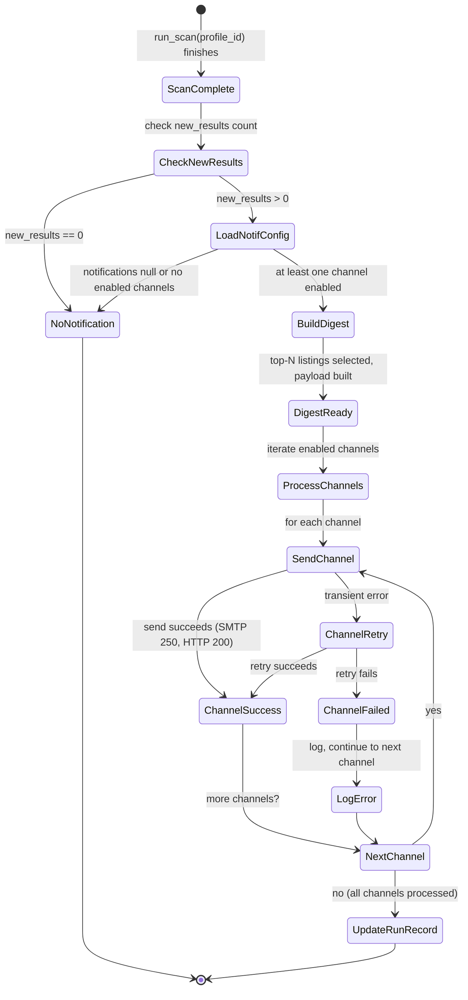

# Multi-Channel Notification Digest — LOD300 System Design

**work_package_id:** S002-P003-WP001
**depends_on:** S002-P001-WP001 (three-entity model — NotificationConfig is embedded in SearchProfile)

---

## 1. System Behavior Overview

After each scan that discovers new listings, the system optionally sends a digest notification via one or more **user-selected channels**. Users configure which channels they want and how many, per search profile. Notifications are embedded in `SearchProfile.notifications` and triggered automatically at the end of `run_scan()`.

**Supported channels (S002):**

| Channel | Transport | User setup | Env vars needed |
|---------|-----------|------------|-----------------|
| **Email** | SMTP | Provide email address | `SMTP_HOST`, `SMTP_PORT`, `SMTP_USER`, `SMTP_PASS`, `SMTP_FROM` |
| **Telegram** | Bot API (HTTPS) | /start the bot, get chat_id | `TELEGRAM_BOT_TOKEN` |
| **Discord** | Webhook (HTTPS POST) | Create webhook in server channel | None (URL is self-authenticating) |
| **ntfy** | HTTPS POST to ntfy.sh | Install ntfy app, subscribe to topic | None (public server) or `NTFY_SERVER_URL` for self-hosted |
| **Webhook** | HTTPS POST to user URL | Provide URL + optional headers | None |

**Key behaviors:**
- **Opt-in:** Notifications are off by default (`notifications: null` in profile). Only sent when configured with at least one enabled channel.
- **Per-profile, not per-city:** Different profiles (even for the same city) can have different notification settings. Users choose which channels and how many.
- **Digest, not real-time:** One summary message per scan per channel containing top-N new listings.
- **Fire-and-forget:** Notification failures never block or fail the scan. One retry per channel, then log and continue.
- **Channel independence:** Each channel operates independently. One can fail while others succeed.
- **Channel limit:** Maximum 5 channels per profile (any combination of types, including duplicates).

---

## 2. Component Interactions

```
runner.run_scan(profile_id)
    │
    ├── [scrapers fetch → upsert → score → verify → publish HTML]
    │
    └── new_results > 0?
        │ YES
        ▼
    ┌──────────────────┐
    │  notify_digest() │  ← shaked_wg_agent/notifier.py
    └────────┬─────────┘
             │
    load profile.notifications.channels[]
    (from SearchProfile — no separate file)
             │
    filter: only enabled channels
             │
    build DigestPayload (shared across all channels)
             │
    ┌────────┼──────────┬──────────┬──────────┐
    ▼        ▼          ▼          ▼          ▼
  Email   Telegram   Discord    ntfy     Webhook
  (SMTP)  (Bot API)  (Webhook)  (POST)   (POST)
    │        │          │          │          │
    └────────┴──────────┴──────────┴──────────┘
                        │
                   update run record
                   (notification_sent: per-channel status)
```

**Sequence — auto-trigger after scan:**

```
1. run_scan(profile_id) completes with new_results > 0
2. Load profile.notifications from SearchProfile (already in memory from config load)
3. If notifications is null or channels list is empty → skip, return
4. Filter channels: only those with enabled == true
5. Build DigestPayload: top-N new listings sorted by score (scored against this profile's preferences)
6. For each enabled channel (independently, in sequence):
   a. Format message for channel type:
      - email: HTML with inline CSS
      - telegram: Markdown (max 4096 chars)
      - discord: JSON embed with fields
      - ntfy: plain text with title/priority/tags headers
      - webhook: JSON payload (DigestPayload)
   b. Send via channel-specific transport
   c. On transient failure: retry once (5s delay), then log error and continue
7. Append notification_sent status (per-channel results) to run record
```

---

## 3. State Model



---

## 4. Data Model

### 4.1 NotificationConfig (embedded in SearchProfile)

**Location:** `data/profiles/{profile_id}.json` → `notifications` field

| Field | Type | Required | Default | Description |
|-------|------|----------|---------|-------------|
| `digest_max_listings` | int | no | 5 | Maximum listings in digest |
| `min_score_threshold` | int | no | 0 | Only include listings with score >= this |
| `channels` | list[ChannelConfig] | yes | [] | Configured notification channels (max 5 per profile) |

### 4.1.1 ChannelConfig (per-channel entry)

Each entry in the `channels` list has a `type` field and type-specific settings:

| Field | Type | Required | Description |
|-------|------|----------|-------------|
| `type` | string | yes | Channel type: `"email"`, `"telegram"`, `"discord"`, `"ntfy"`, `"webhook"` |
| `enabled` | bool | yes | Whether this channel is active |
| `label` | string | no | User-defined label for this channel (e.g. "Personal email") |

**Type-specific fields:**

| Type | Additional fields | Description |
|------|------------------|-------------|
| `email` | `recipients: list[string]` | Email addresses to send digest to |
| `telegram` | `chat_id: string` | Telegram chat ID for the bot |
| `discord` | `webhook_url: string` | Discord webhook URL (from server settings) |
| `ntfy` | `topic: string`, `server_url: string` (optional, default `"https://ntfy.sh"`) | ntfy topic name; default is public ntfy.sh server |
| `webhook` | `url: string`, `headers: dict[string, string]` (optional) | Generic webhook URL + optional auth headers |

**Example (within profile JSON):**

```json
{
  "profile_id": "default",
  "profile_name": "Shaked Basel WG Search",
  "city_id": "basel",
  "...": "...",
  "notifications": {
    "digest_max_listings": 5,
    "min_score_threshold": 40,
    "channels": [
      {
        "type": "email",
        "enabled": true,
        "label": "Personal email",
        "recipients": ["shaked@example.com"]
      },
      {
        "type": "telegram",
        "enabled": true,
        "chat_id": "123456789"
      },
      {
        "type": "discord",
        "enabled": false,
        "webhook_url": "https://discord.com/api/webhooks/123/abc..."
      },
      {
        "type": "ntfy",
        "enabled": true,
        "topic": "shaked-wg-a8f3k2x9"
      }
    ]
  }
}
```

**S003 transition:** No structural change needed. Each user's profile already carries their own notification preferences with their own channels list. Multi-user = each user manages their own `notifications` field.

### 4.2 DigestPayload (internal, not persisted)

| Field | Type | Description |
|-------|------|-------------|
| `profile_id` | string | Which profile triggered this digest |
| `profile_name` | string | Profile display name |
| `city_id` | string | Which city was scanned |
| `city_name` | string | City display name |
| `run_id` | string | Run that triggered this digest |
| `scan_timestamp` | string (ISO 8601) | When the scan ran |
| `total_new` | int | Total new listings found |
| `listings` | list[ListingSummary] | Top-N listings for digest |

### 4.3 ListingSummary (subset for digest)

| Field | Type | Description |
|-------|------|-------------|
| `title` | string | Listing title |
| `price_chf` | int or null | Monthly rent |
| `district` | string | Neighborhood |
| `relevance_score` | int | 0-100 score (scored against this profile's preferences) |
| `direct_url` | string | Link to listing |
| `vegan_signal` | string | Vegan compatibility |
| `transit_match_lines` | list[string] | Matched public transport lines (from this profile's transit_lines) |

### 4.4 Run Record Extension

The existing run record dict gains a new field:

| Field | Type | Description |
|-------|------|-------------|
| `notification_sent` | NotificationResult | Delivery status |

```json
{
  "notification_sent": {
    "channels": [
      {"type": "email", "label": "Personal email", "success": true, "error": null},
      {"type": "telegram", "success": false, "error": "HTTP 429 rate limited (retry exhausted)"},
      {"type": "ntfy", "success": true, "error": null}
    ],
    "total_sent": 2,
    "total_failed": 1
  }
}
```

If notifications were not configured or not triggered (new_results == 0), this field is `null`.

---

## 5. Interface Contracts

| Interface | Producer | Consumer | Contract |
|-----------|----------|----------|----------|
| `notify_digest(profile, city, run_record, new_listings)` | notifier.py | runner.py | Called after scan; takes SearchProfile + CityDefinition; never raises; returns NotificationResult |
| `SearchProfile.notifications` | config.py (loaded from profile JSON) | notifier.py | Conforms to NotificationConfig schema; null = no notifications |
| `SMTP_HOST`, `SMTP_PORT`, `SMTP_USER`, `SMTP_PASS`, `SMTP_FROM` | .env file | notifier.py | Email credentials; absent = email channels skipped with warning |
| `TELEGRAM_BOT_TOKEN` | .env file | notifier.py | Bot token; absent = Telegram channels skipped with warning |
| Discord webhook URL | ChannelConfig.webhook_url | notifier.py | Self-authenticating; no env var needed |
| ntfy topic | ChannelConfig.topic + optional server_url | notifier.py | Public ntfy.sh by default; no env var needed (self-hosted: `NTFY_SERVER_URL` optional) |
| Webhook URL | ChannelConfig.url + optional headers | notifier.py | User-provided URL; no env var needed |
| `POST /notify` (future) | API layer (S002-P002-WP001) | notifier.py | Same `notify_digest()` call, manually triggered |

---

## 6. Business Rules

1. **Notifications are opt-in.** If `profile.notifications` is null or `channels` list is empty, no notifications are sent. No error raised.
2. **Channel independence.** Each channel operates independently. Failure of one channel does not prevent others from being attempted.
3. **Never block scan.** `notify_digest()` catches all exceptions internally. Return value indicates success/failure per channel.
4. **One retry per channel.** On transient failure (timeout, connection refused, HTTP 429/5xx), wait 5 seconds and retry once. If retry fails, log error and continue to next channel.
5. **Permanent failures not retried.** HTTP 400/401/403 = permanent failure, do not retry. Applies to all HTTP-based channels.
6. **Digest content.** Top-N listings sorted by `relevance_score` descending. N = `digest_max_listings` (default 5). Only listings with score >= `min_score_threshold` are included. Scores are computed against this profile's preferences (budget, diet, smoking_policy, transit_lines, rental_duration, custom_tags).
7. **Channel limit.** Maximum 5 channels per profile. Users may configure multiple channels of the same type (e.g. two email channels with different recipients).
8. **Email format.** HTML email with inline CSS. Subject line: `"[Shaked WG] {profile_name}: {total_new} neue Angebote"`. Body: listing cards with title, price, district, score, link.
9. **Telegram format.** Markdown message. Header includes profile name and city. One listing per line: `"🏠 *{title}* — CHF {price} ({district}) — Score: {score}/100\n{direct_url}"`. Max 4096 chars (Telegram limit) — truncate if needed.
10. **Discord format.** JSON payload with `embeds` array. One embed per listing: title, description, color-coded by score, fields for price/district/score. Max 10 embeds per message (Discord limit).
11. **ntfy format.** Plain text body with listing summaries. Title header: `"[Shaked WG] {total_new} neue Angebote"`. Priority header: 3 (default) or 4 (high, if any listing scores >= 80). Click URL header: link to first listing. Tags header: `"house"`.
12. **Webhook format.** POST JSON payload matching DigestPayload schema to the user-provided URL. Content-Type: `application/json`. Optional custom headers from channel config (e.g. Authorization).
13. **Missing credentials.** If `SMTP_*` env vars are missing and an email channel is enabled, log warning and skip that channel. Same for `TELEGRAM_BOT_TOKEN`. Discord, ntfy, and webhook channels are self-contained (URL in config) — no env vars needed.
14. **Notification result persisted.** The `notification_sent` field in the run record captures per-channel delivery status for operational visibility.
15. **Disabled channels skipped.** Channels with `enabled: false` are silently skipped — no log entry, no error.

---

## 7. Acceptance Criteria

| AC | Description | Verification |
|----|-------------|--------------|
| AC-1 | Email channel: SMTP send attempted when enabled with valid env vars | Unit test (mock SMTP) |
| AC-2 | Telegram channel: Bot API POST attempted when enabled with valid token | Unit test (mock HTTP) |
| AC-3 | Discord channel: webhook POST attempted when enabled with valid URL | Unit test (mock HTTP) |
| AC-4 | ntfy channel: POST to ntfy server attempted when enabled with topic | Unit test (mock HTTP) |
| AC-5 | Webhook channel: POST to user URL attempted when enabled | Unit test (mock HTTP) |
| AC-6 | new_results == 0 → no notification sent on any channel | Unit test |
| AC-7 | profile.notifications is null → no notification, no error | Unit test |
| AC-8 | Channel failure does not prevent other channels from sending | Unit test |
| AC-9 | Transient failure retried once per channel, then logged | Unit test |
| AC-10 | Run record includes per-channel `notification_sent` status | Unit test |
| AC-11 | Email subject contains profile_name and new listing count | Unit test |
| AC-12 | Telegram message fits within 4096 char limit | Unit test |
| AC-13 | Discord embed respects 10-embed limit | Unit test |
| AC-14 | Missing SMTP env vars → email channel skipped with warning, no crash | Unit test |
| AC-15 | Maximum 5 channels enforced per profile | Unit test |

---

## 8. Open Design Questions (Resolved)

| Question | Decision | Rationale |
|----------|----------|-----------|
| Should notifications be per-city or per-profile? | **Per-profile.** | Notifications are user preferences, not city properties. In S003, different users searching the same city need independent notification settings. |
| Should notification config be a separate file? | **No — embedded in SearchProfile.** | One less file to manage. Config is inherently tied to the profile. In S003, moves to PostgreSQL as profile column. |
| Flat per-channel fields or channels list? | **Channels list.** | Extensible (add new channel types without schema change), allows duplicates (two emails), user controls which and how many. |
| Which channels to support? | **5: Email, Telegram, Discord, ntfy, Webhook.** | All zero-cost to system and user. WhatsApp (no free API), Signal (no stable API), SMS (paid) excluded. Slack, Matrix, Web Push deferred. |
| Should notifications have a quiet hours setting? | **No — not in S002.** | Single-user tool; scan is manually triggered or cron-scheduled. |
| Should notification history be persisted separately? | **No — stored in run record.** | Run record already captures per-scan metadata. |
| HTML email or plain text? | **HTML with inline CSS.** | Richer display of listing cards. |
| Telegram: individual messages or single digest? | **Single digest message.** | Avoids rate limiting. One message per scan is sufficient. |
| ntfy: public server or self-hosted? | **Public ntfy.sh by default, self-hosted optional.** | Zero setup for users. Long random topic name provides practical privacy. Self-hosted via optional `server_url` field. |
| Discord: bot or webhook? | **Webhook.** | Zero-dependency, no bot registration, no gateway connection. Single HTTPS POST with rich embeds. |

---

## 9. S003 Transition Path

| S002 | S003 Change |
|------|-------------|
| `profile.notifications` embedded in JSON file | Moves to PostgreSQL `search_profiles.notifications` JSONB column |
| Single user's channels list | Per-user notification channels — each user manages their own |
| SMTP_FROM is global | SMTP_FROM may become per-tenant or use service email |
| TELEGRAM_BOT_TOKEN is global | May become per-tenant bot or shared with user-specific chat_id |
| 5-channel limit per profile | May increase or become per-plan in SaaS |
| Additional channels (Slack, Matrix, Web Push) | Can be added as new `type` values — no schema change needed |

No structural model changes needed — the per-profile design already supports multi-user.

---

## 10. LOD300 Exit Criteria

- [x] All component interfaces defined
- [x] All state transitions defined
- [x] No open design questions
- [x] Per-profile notification model (not per-city)
- [ ] Consuming team (builder) confirms: executable from this design
