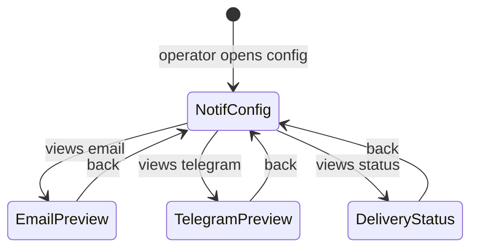

# Mockup — S002-P003-WP001: Email/Telegram Notifications

**Format:** HTML Prototype (Option B) + Screen Narrative
**WP:** S002-P003-WP001
**Screens:** 5 | **Flows:** 2
**HTML files:** `mockup_html/`

---

## Section 1: State Diagram

## Section 2: Screen/View Inventory

| Screen Name | States | Entry Condition | Primary Actor | Exit Destinations |
|-------------|--------|-----------------|---------------|-------------------|
| Notification Config | NotifConfig | Open config | Operator | Previews, Status |
| Email Digest Preview | EmailPreview | Click email tab | Operator | NotifConfig |
| Telegram Preview | TelegramPreview | Click telegram tab | Operator | NotifConfig |
| Delivery Status | DeliveryStatus | Click status tab | Operator | NotifConfig |

## Section 3: Screen Narratives

### Screen: Notification Config (`notification_config.html`)
- Shows notification config as embedded in SearchProfile (`profile.notifications`)
- File path: `data/profiles/default.json` (notifications field)
- Env vars needed (SMTP_*, TELEGRAM_BOT_TOKEN)
- Channel enable/disable toggles (read-only display)

### Screen: Email Digest Preview (`email_digest_preview.html`)
- Realistic HTML email: subject includes profile_name, 3 listing cards with score/price/district, footer
- Shows what recipient actually receives

### Screen: Telegram Preview (`telegram_message_preview.html`)
- Telegram-style bubble with emoji-formatted listings
- Header includes profile name and city
- Shows 4096 char limit behavior

### Screen: Delivery Status (`delivery_status.html`)
- Run record with notification_sent field
- Success, partial failure, and skipped scenarios

## Section 4: Critical Flows

### Flow 1: Successful Digest
1. Scan with profile "default" finds 3 new listings → digest built
2. Email sent (SMTP 250) → Telegram sent (HTTP 200)
3. Run record: {email: true, telegram: true, errors: []}

### Flow 2: Partial Failure
1. Email succeeds, Telegram rate-limited
2. Telegram retry → fails again → logged
3. Run record: {email: true, telegram: false, errors: ["..."]}
