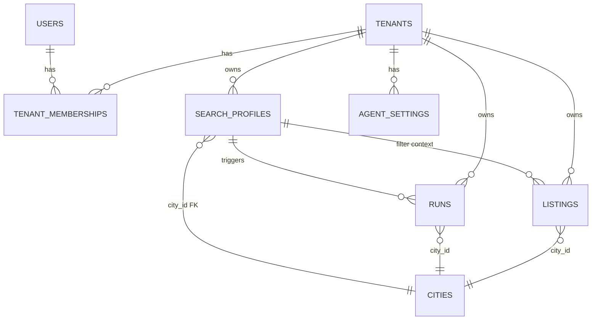
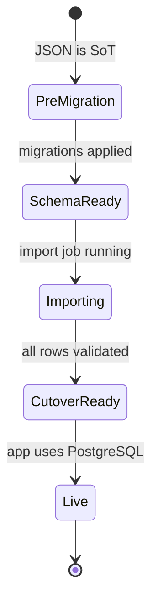

# Multi-Tenant Data Model (Tenants, Users, Profiles, Results) — LOD300 System Design

**work_package_id:** S003-P001-WP001  
**profile:** L2.5 / Track B  
**parent_lod200:** N/A — milestone entry from `_aos/roadmap.yaml` and `_COMMUNICATION/team_100/S003-P001-WP001_SPEC_STATUS_2026-04-18.md` (no separate LOD200 for this WP).  
**depends_on:** S002 complete (three-entity JSON model + REST API + API key auth).  
**informs:** `S003-P001-WP002` (tenant isolation + auth middleware — JWT/RLS consume this schema).

---

## 1. System Behavior Overview

### 1.1 Purpose

Introduce a **PostgreSQL-backed canonical persistence layer** for all **tenant-scoped** operational data: **tenants**, **users**, **memberships**, **search profiles**, **listings**, and **scan runs**. Shared reference data (**cities**, **sources**) remains globally readable and is modeled as shared tables populated from existing JSON registries.

This WP is **schema + migration + repository contracts only**. It does **not** implement JWT, middleware, or Row-Level Security policies — those belong to **S003-P001-WP002**, but **must** consume the identifiers and foreign keys defined here.

### 1.2 Current state (S002)

- Listings and runs: **`data/listings.json`**, **`data/runs.json`** (JSON arrays, process-wide file locks assumed single-user).
- Config: **`data/agent.json`**, **`data/profiles/{id}.json`**, **`data/cities/{id}.json`**, **`data/sources.json`**.
- **No SQLite** in the current codebase; roadmap wording “SQLite → PostgreSQL” is interpreted as **file-backed persistence → PostgreSQL**. If a SQLite store appears in a fork, the same migration pipeline applies.

### 1.3 Target state (after this WP)

- Single **PostgreSQL** database (version **15+**), one schema (`public` unless overridden by env).
- Every tenant-owned row carries **`tenant_id`** (UUID).
- Application code gains a **persistence adapter** that reads/writes SQL instead of JSON for listings/runs/profile/agent metadata **per tenant** (exact module layout in LOD400 — not in this document).
- **Bootstrap path:** exactly one **legacy tenant** + one **bootstrap user** + migration of existing JSON data into that tenant so production behavior remains continuity-safe.

### 1.4 Explicit out of scope (handled elsewhere)

| Topic | Owner |
|-------|--------|
| JWT issuance, session, password flows | S003-P001-WP002 |
| Enforcing RLS policies in PostgreSQL | S003-P001-WP002 (may enable after schema exists) |
| Billing provider, subscriptions, invoices | S003-P002-* |
| Full RBAC permission matrix beyond membership role enum | S003-P003-* |
| Per-tenant API keys lifecycle | S003-P003-WP002 |

---

## 2. Component Interactions

```
┌─────────────────────────────────────────────────────────────────────────┐
│                         Application (CLI / API / workers)                │
│  Every request carries implicit or explicit tenant_id after auth (WP002) │
└───────────────────────────────────┬─────────────────────────────────────┘
                                    │
                                    ▼
┌─────────────────────────────────────────────────────────────────────────┐
│                    Persistence / Repository layer (new)                  │
│  - Resolves tenant_id (from auth context in S003; bootstrap: fixed UUID)│
│  - Queries always filter by tenant_id for tenant-owned tables              │
└───────────────────────────────────┬─────────────────────────────────────┘
                                    │
          ┌─────────────────────────┼─────────────────────────┐
          ▼                         ▼                         ▼
   ┌─────────────┐           ┌─────────────┐           ┌─────────────┐
   │  PostgreSQL │           │  PostgreSQL │           │  PostgreSQL │
   │  tenant_*   │           │  shared ref │           │  results    │
   │  tables     │           │  cities,    │           │  listings,  │
   │             │           │  sources    │           │  runs       │
   └─────────────┘           └─────────────┘           └─────────────┘

Migration utility (one-off / CLI):
  data/*.json  ──import──►  PostgreSQL (legacy tenant)
```

### 2.1 Sequence — load search profile for scan (post-S003)

```
1. Auth middleware (WP002) validates JWT → sets request.state.user_id, tenant_id
2. Runner asks repository for SearchProfile by (tenant_id, profile_slug)
3. Repository SELECT ... WHERE tenant_id = $1 AND profile_slug = $2
4. City + sources resolved from shared tables + profile JSON fields
5. Scan proceeds; listings upserted with same tenant_id + profile_id FK
```

### 2.2 Sequence — bootstrap migration (maintenance window)

```
1. Apply DDL (Alembic/SQL migrations) — empty tables
2. INSERT tenant (legacy) + user (bootstrap) + membership (admin)
3. Import cities/sources from JSON → shared tables (idempotent upsert)
4. Import profiles from data/profiles/*.json → search_profiles (tenant-scoped)
5. Import listings.json → listings (assign tenant_id + profile FK)
6. Import runs.json → runs
7. Flip feature flag / config: persistence_mode = postgresql
8. Retain JSON files read-only backup until LOD500 sign-off
```

---

## 3. Multi-Tenant Isolation Strategy

### 3.1 Chosen approach: **shared schema + tenant_id column**

- **Rationale:** Operational simplicity, single migration path, aligns with row-level security later (WP002).
- **Rejected for MVP:** Database-per-tenant (heavy ops), schema-per-tenant (migration complexity).

### 3.2 Enforcement layers

| Layer | Responsibility |
|-------|------------------|
| **Application (MVP)** | Every query includes `WHERE tenant_id = :current_tenant` |
| **PostgreSQL RLS (WP002+)** | Policies using `current_setting('app.tenant_id')` or session variable set by middleware |
| **Foreign keys** | Child rows reference parent rows that share the same `tenant_id` (composite FKs where needed) |

### 3.3 Global vs tenant-scoped data

| Data | Scope | Notes |
|------|--------|------|
| `cities`, `sources` | **Global** | Loaded from existing JSON; no `tenant_id` |
| `tenants`, `users`, `tenant_memberships` | **Global** | Users may join multiple tenants via memberships |
| `search_profiles`, `listings`, `runs`, `agent_settings` | **Tenant-scoped** | Must include `tenant_id` |

---

## 4. Data Model (Logical ERD)



---

## 5. Physical Schema (PostgreSQL)

**Conventions**

- **IDs:** UUID primary keys (`gen_random_uuid()`), except natural keys where already stable (`city_id` text).
- **Timestamps:** `timestamptz` — `created_at`, `updated_at` where mutable.
- **JSONB:** For fields that evolve frequently (notification config, extra listing attrs) — mirror S002 flexibility.

### 5.1 `tenants`

| Column | Type | Constraints |
|--------|------|-------------|
| `id` | UUID | PK |
| `slug` | TEXT | UNIQUE NOT NULL — URL-safe tenant key |
| `display_name` | TEXT | NOT NULL |
| `status` | TEXT | NOT NULL — `active` \| `suspended` |
| `created_at` | timestamptz | NOT NULL DEFAULT now() |

### 5.2 `users`

| Column | Type | Constraints |
|--------|------|-------------|
| `id` | UUID | PK |
| `email` | TEXT | UNIQUE NOT NULL — global login identity |
| `display_name` | TEXT | |
| `created_at` | timestamptz | NOT NULL DEFAULT now() |

> **Auth secrets** (password hash, OAuth sub) — stored here or in separate `user_credentials` table in **WP002**; this WP reserves optional nullable `external_subject` TEXT for IdP linkage.

### 5.3 `tenant_memberships`

| Column | Type | Constraints |
|--------|------|-------------|
| `tenant_id` | UUID | FK → tenants(id) ON DELETE CASCADE |
| `user_id` | UUID | FK → users(id) ON DELETE CASCADE |
| `role` | TEXT | NOT NULL — `admin` \| `agent` \| `viewer` (aligns S003-P003 RBAC labels) |
| `created_at` | timestamptz | NOT NULL DEFAULT now() |

**PK:** `(tenant_id, user_id)`.

### 5.4 `cities` (global)

| Column | Type | Constraints |
|--------|------|-------------|
| `city_id` | TEXT | PK — matches JSON file stem (`basel`, `zurich`, …) |
| `definition` | JSONB | NOT NULL — full `CityDefinition` export |
| `updated_at` | timestamptz | NOT NULL |

### 5.5 `sources` (global)

| Column | Type | Constraints |
|--------|------|-------------|
| `source_id` | TEXT | PK |
| `definition` | JSONB | NOT NULL — full `SourceDefinition` export |
| `updated_at` | timestamptz | NOT NULL |

### 5.6 `search_profiles`

| Column | Type | Constraints |
|--------|------|-------------|
| `id` | UUID | PK |
| `tenant_id` | UUID | FK → tenants(id) ON DELETE CASCADE |
| `profile_slug` | TEXT | NOT NULL — human id (`default`, `dror`, …) |
| `definition` | JSONB | NOT NULL — `SearchProfile` + nested notification config |
| `city_id` | TEXT | FK → cities(city_id) |
| `created_at` | timestamptz | NOT NULL |
| `updated_at` | timestamptz | NOT NULL |

**UNIQUE:** `(tenant_id, profile_slug)`.

### 5.7 `agent_settings` (tenant-level ex-`agent.json`)

| Column | Type | Constraints |
|--------|------|-------------|
| `tenant_id` | UUID | PK FK → tenants(id) ON DELETE CASCADE |
| `default_profile_slug` | TEXT | NOT NULL |
| `manual_triggers_only` | BOOLEAN | NOT NULL DEFAULT true |
| `project_window_days` | INT | NOT NULL |
| `project_start` | DATE | |
| `project_end` | DATE | |

### 5.8 `listings`

| Column | Type | Constraints |
|--------|------|-------------|
| `id` | UUID | PK |
| `tenant_id` | UUID | FK → tenants(id) ON DELETE CASCADE |
| `profile_id` | UUID | FK → search_profiles(id) ON DELETE SET NULL |
| `listing_key` | TEXT | NOT NULL — former `listing_id` string (e.g. `flatfox-85903643`) |
| `payload` | JSONB | NOT NULL — full listing document as today |
| `city_id` | TEXT | FK → cities(city_id) — denormalized for indexing |
| `relevance_score` | INT | |
| `first_seen_at` | timestamptz | |
| `last_seen_at` | timestamptz | |

**UNIQUE:** `(tenant_id, listing_key)`.

**Indexes:** `(tenant_id, city_id)`, `(tenant_id, relevance_score DESC)`.

### 5.9 `runs`

| Column | Type | Constraints |
|--------|------|-------------|
| `id` | UUID | PK |
| `tenant_id` | UUID | FK → tenants(id) ON DELETE CASCADE |
| `run_key` | TEXT | NOT NULL — former `run_id` |
| `profile_id` | UUID | FK → search_profiles(id) |
| `payload` | JSONB | NOT NULL — full run record |
| `run_timestamp` | timestamptz | NOT NULL |

**UNIQUE:** `(tenant_id, run_key)`.

**Index:** `(tenant_id, run_timestamp DESC)`.

---

## 6. Migration Plan (JSON → PostgreSQL)

### 6.1 Principles

1. **Idempotent imports** — re-running import on same data does not duplicate rows (UPSERT on natural keys).
2. **Legacy tenant** — single tenant `slug=legacy` (or `default-org`) receives all pre-S003 data.
3. **Bootstrap user** — one `users` row; membership `admin` on legacy tenant.
4. **Profile slug** — filename stem `data/profiles/{slug}.json` → `search_profiles.profile_slug`.
5. **Listings** — `listing_key` = existing `listing_id` field from JSON.

### 6.2 Ordering

1. tenants, users, tenant_memberships  
2. cities, sources (from `data/cities/*.json`, `data/sources.json`)  
3. search_profiles (from `data/profiles/*.json`)  
4. agent_settings (from `data/agent.json` + default profile resolution)  
5. listings, runs  

### 6.3 Split-WP contingency (T100-REQ-003)

If implementation schedule requires split: **WP001a** = schema + shared tables only; **WP001b** = data migration tooling + cutover. This LOD300 remains valid as **logical** design; delivery can be phased without changing identifiers.

---

## 7. State Model

No long-running state machine for the DB layer itself. Operational states:



---

## 8. Interface Contracts (downstream)

| Interface | Producer | Consumer | Contract |
|-----------|----------|----------|----------|
| `TenantContext` (tenant_id, user_id, roles[]) | S003-P001-WP002 auth | Runner, API routes | Resolved per request after JWT validation |
| `ListingRepository` | This WP (impl in LOD400) | Runner, API | All methods require `tenant_id` |
| `RunRepository` | This WP | Runner, API | Same |
| `ProfileLoader` | This WP | Runner | Load profile by (tenant_id, slug) |
| DDL + migrations | Builder (team_60/50) | DBA / CI | Alembic revision chain in repo |

---

## 9. UX / Mockups (Team 00 human gate — data implications)

**Textual mockups** (screen layout not in scope for WP001; data requirements only):

1. **Tenant switcher (future)** — user with multiple memberships selects tenant → `tenant_id` in session changes → all queries scoped.
2. **Profile list** — table keyed by `(tenant_id)` showing `profile_slug`, `city_id`, last run time.
3. **Admin: legacy migration status** — read-only view: row counts per table, last import timestamp.

---

## 10. Business Rules

1. **`tenant_id` is mandatory** on `search_profiles`, `listings`, `runs`, `agent_settings`.
2. **Listings and runs** never cross tenants; composite uniqueness includes `tenant_id`.
3. **City and source registries** are global; tenants reference them by `city_id` / `source_id` strings inside JSON payloads.
4. **email** globally unique simplifies login before org-invite flows (can revise in future WP if product demands email per tenant).
5. **Retention** (`retention_days`) stays inside `SearchProfile` JSON until a future WP extracts policy columns.
6. **Currency / price fields** remain inside `payload` JSONB until S005 internationalization hardens column extraction.

---

## 11. Non-Functional

| Aspect | Target |
|--------|--------|
| DB | PostgreSQL 15+, `UTF8` |
| Connections | Pool size TBD — SQLAlchemy/asyncpg or psycopg (LOD400) |
| Backup | Operator responsibility; PITR recommended pre-cutover |
| Migrations | Forward-only Alembic; rollback = restore backup |

---

## 12. Open Design Questions (Resolved)

| Question | Decision | Rationale |
|----------|----------|-----------|
| SQLite mentioned in roadmap | **Migrate from JSON**; SQLite not present in repo | Accurate as-built |
| Shared vs schema-per-tenant | **Shared schema + tenant_id** | SaaS ops simplicity |
| Natural key for listing | **`listing_key` text** preserved from S002 | Stable URLs and user bookmarks |
| Where to put RBAC | **`tenant_memberships.role`** minimal enum | S003-P003 expands matrix |
| Billing columns on tenant | **Deferred** — optional `plan_tier` TEXT nullable later | No blocker for schema; billing WP adds constraints |

---

## 13. LOD300 Exit Criteria

- [x] Multi-tenant isolation strategy documented (shared schema + `tenant_id`)
- [x] Full relational schema for tenants, users, memberships, profiles, listings, runs, agent settings, shared cities/sources
- [x] Migration ordering and bootstrap tenant defined
- [x] Interface contracts for WP002 and runners stated
- [x] Explicit out-of-scope boundaries for auth/billing/RBAC
- [x] Open questions resolved or deferred with owner
- [ ] **Team 00** human review — LOD300 mockup + UX gate (per `_COMMUNICATION/team_00/AOS_CANONIZATION_WORK_PLAN.md` §4.5)
- [ ] **EXT-CP1** (Team 190) — pre-pipeline entry per project methodology
- [ ] Consuming team (**team_110** / builder) confirms: **LOD400 can be written without ambiguity**

---

## 14. References

- `_aos/roadmap.yaml` — S003-P001-WP001, S003-P001-WP002
- `_COMMUNICATION/team_00/AOS_CANONIZATION_WORK_PLAN.md` — §4.5 S003 L2.5 requirements
- `_aos/work_packages/S002-P001-WP001/LOD300_S002-P001-WP001.md` — three-entity predecessor
- `_aos/work_packages/S002-P002-WP002/LOD300_S002-P002-WP002.md` — S003 auth transition
- `_archive/S001-P002-WP001/team_100/ARCH_REVIEW_2026-04-11.md` — T100-REQ-003 split risk

---

*End of LOD300 — S003-P001-WP001 — team_100 — v1.0.0 — 2026-04-18*
